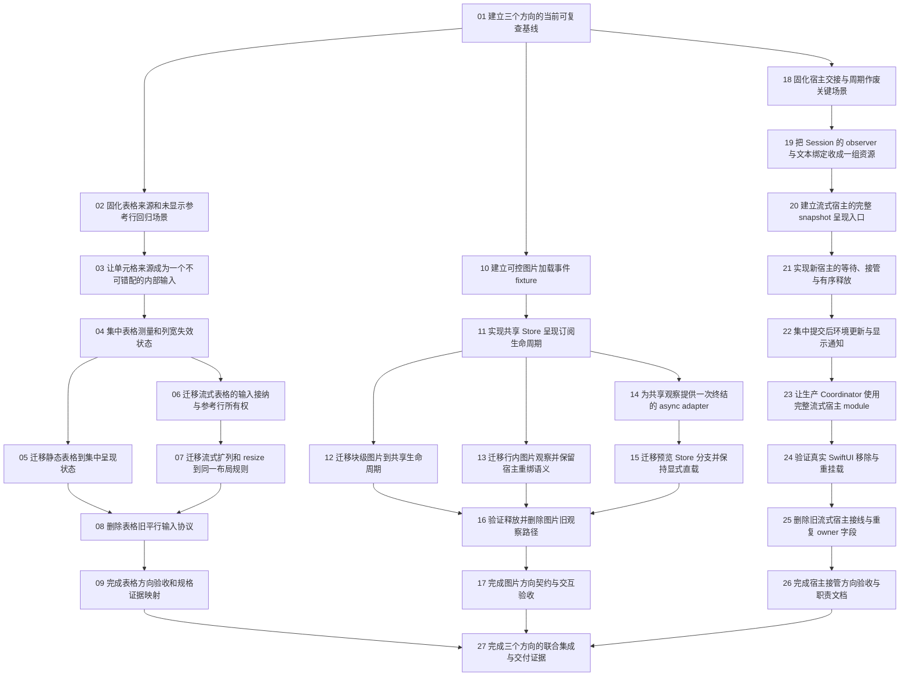

# Tickets、依赖与覆盖索引

Status: ready-for-agent

本目录共 27 票，每票一个文件。全部尚未实施；readiness 不表示依赖已完成或已有实施授权。

## 结构

| 方向 | 票范围 | 数量 | 出口 |
| --- | --- | --- | --- |
| 当前基线 | 01 | 1 | 实际基线证据 |
| 表格呈现 | 02–09 | 8 | 09 |
| 图片订阅 | 10–17 | 8 | 17 |
| 宿主接管 | 18–26 | 9 | 26 |
| 联合集成 | 27 | 1 | 最终交付证据 |

## 每票入口

| 票 | 结果 | 依赖 | 验收 |
| --- | --- | --- | --- |
| [01](issues/01-capture-current-baseline.md) | 建立三个方向的当前可复查基线 | 无 | G-07, G-08 |
| [02](issues/02-table-source-regression.md) | 固化表格来源和未显示参考行回归场景 | 01 | T-01, T-03, T-04 |
| [03](issues/03-table-cell-source.md) | 让单元格来源成为一个不可错配的内部输入 | 02 | T-01, T-02, T-03, T-11 |
| [04](issues/04-table-layout-state.md) | 集中表格测量和列宽失效状态 | 03 | T-04, T-05, T-06, T-07 |
| [05](issues/05-table-static-adapter.md) | 迁移静态表格到集中呈现状态 | 04 | T-01, T-02, T-05, T-08, T-10 |
| [06](issues/06-table-stream-input.md) | 迁移流式表格的输入接纳与参考行所有权 | 04 | T-03, T-04, T-09 |
| [07](issues/07-table-stream-layout.md) | 迁移流式扩列和 resize 到同一布局规则 | 06 | T-04, T-05, T-06, T-07, T-10 |
| [08](issues/08-table-contract-old-plumbing.md) | 删除表格旧平行输入协议 | 05, 07 | T-11, G-02, G-09 |
| [09](issues/09-table-acceptance.md) | 完成表格方向验收和规格证据映射 | 08 | T-01, T-02, T-03, T-04, T-05, T-06, T-07, T-08, T-09, T-10, T-11, T-12 |
| [10](issues/10-image-controlled-loader.md) | 建立可控图片加载事件 fixture | 01 | I-02, I-03, I-04 |
| [11](issues/11-image-load-module.md) | 实现共享 Store 呈现订阅生命周期 | 10 | I-01, I-02, I-03, I-04, I-05 |
| [12](issues/12-image-block-adapter.md) | 迁移块级图片到共享生命周期 | 11 | I-01, I-03, I-06 |
| [13](issues/13-image-attachment-adapter.md) | 迁移行内图片观察并保留宿主重绑语义 | 11 | I-03, I-07, I-08 |
| [14](issues/14-image-async-adapter.md) | 为共享观察提供一次终结的 async adapter | 11 | I-09 |
| [15](issues/15-image-preview-adapter.md) | 迁移预览 Store 分支并保持显式直载 | 14 | I-09, I-10 |
| [16](issues/16-image-lifetime-contract.md) | 验证释放并删除图片旧观察路径 | 12, 13, 15 | I-05, I-11, I-12, G-02, G-09 |
| [17](issues/17-image-acceptance.md) | 完成图片方向契约与交互验收 | 16 | I-01, I-02, I-03, I-04, I-05, I-06, I-07, I-08, I-09, I-10, I-11, I-12 |
| [18](issues/18-host-handoff-regression.md) | 固化宿主交接与周期作废关键场景 | 01 | S-02, S-03, S-04, S-05, S-07, S-12 |
| [19](issues/19-session-binding-grant.md) | 把 Session 的 observer 与文本绑定收成一组资源 | 18 | S-03, S-05, S-08, G-05 |
| [20](issues/20-host-render-snapshot.md) | 建立流式宿主的完整 snapshot 呈现入口 | 19 | S-01, S-06, S-09 |
| [21](issues/21-host-ownership-release.md) | 实现新宿主的等待、接管与有序释放 | 20 | S-02, S-03, S-04, S-05, S-06, S-10 |
| [22](issues/22-host-environment-events.md) | 集中提交后环境更新与显示通知 | 21 | S-02, S-07, S-08, S-09, S-12 |
| [23](issues/23-coordinator-use-host.md) | 让生产 Coordinator 使用完整流式宿主 module | 22 | S-01, S-04, S-07, S-08, S-11, S-14 |
| [24](issues/24-swiftui-remount-regression.md) | 验证真实 SwiftUI 移除与重挂载 | 23 | S-06, S-11, S-12, S-13 |
| [25](issues/25-host-contract-old-plumbing.md) | 删除旧流式宿主接线与重复 owner 字段 | 24 | S-14, G-02, G-05, G-09 |
| [26](issues/26-host-acceptance.md) | 完成宿主接管方向验收与职责文档 | 25 | S-01, S-02, S-03, S-04, S-05, S-06, S-07, S-08, S-09, S-10, S-11, S-12, S-13, S-14 |
| [27](issues/27-integrated-final-gates.md) | 完成三个方向的联合集成与交付证据 | 09, 17, 26 | G-01, G-02, G-03, G-04, G-05, G-06, G-07, G-08, G-09, G-10, T-12, I-12, S-14 |

## 依赖图

## 依赖理由与分派限制

- 01 建立共同基线；02/10/18 不互相阻塞。
- 表格 03 建立来源值，04 建立统一布局；05 与 06 在逻辑上可并行，07 只依赖流式输入迁移 06，08 在静态 05 与流式 07 都完成后才能删除旧协议，09 收集最终方向证据。
- 图片 11 是共同观察 implementation；12 与 13 分别迁移 block/attachment；14 提供 async adapter，15 才能迁移 preview。16 要三个入口完成后统一清理，17 是方向出口。
- 宿主 20–22 为新 host 逐步建立可测试能力，23 只能在其完整后切换生产 Coordinator，24 验证真实 SwiftUI 生命周期，25 才可安全删除旧接线。
- 27 只依赖方向出口 09/17/26，其他约束已经被传递依赖表达，不重复添加所有票为直接依赖。
- 编号不是新的跨方向依赖。用户可授权单独方向，但前置基线仍需建立。

### 文件冲突约束

DAG 无依赖不等于可同时写同一文件。弱模型建议串行。若以后明确授权并行，05/06 可能共享 helper，12/13/14 可能共享 load module/测试，三个方向也会触及共享回归测试或职责文档；这些文件要指定单一编辑者，其他任务提交明确差异建议，不能同时覆盖。27 在方向出口全部收敛后执行。

## 验收覆盖

此表是需求到责任票的静态映射，不是通过清单。实施证据须填写在对应 evidence 文件。

| 验收编号 | 责任票 |
| --- | --- |
| G-01 | 27 |
| G-02 | 08, 16, 25, 27 |
| G-03 | 27 |
| G-04 | 27 |
| G-05 | 19, 25, 27 |
| G-06 | 27 |
| G-07 | 01, 27 |
| G-08 | 01, 27 |
| G-09 | 08, 16, 25, 27 |
| G-10 | 27 |
| I-01 | 11, 12, 17 |
| I-02 | 10, 11, 17 |
| I-03 | 10, 11, 12, 13, 17 |
| I-04 | 10, 11, 17 |
| I-05 | 11, 16, 17 |
| I-06 | 12, 17 |
| I-07 | 13, 17 |
| I-08 | 13, 17 |
| I-09 | 14, 15, 17 |
| I-10 | 15, 17 |
| I-11 | 16, 17 |
| I-12 | 16, 17, 27 |
| S-01 | 20, 23, 26 |
| S-02 | 18, 21, 22, 26 |
| S-03 | 18, 19, 21, 26 |
| S-04 | 18, 21, 23, 26 |
| S-05 | 18, 19, 21, 26 |
| S-06 | 20, 21, 24, 26 |
| S-07 | 18, 22, 23, 26 |
| S-08 | 19, 22, 23, 26 |
| S-09 | 20, 22, 26 |
| S-10 | 21, 26 |
| S-11 | 23, 24, 26 |
| S-12 | 18, 22, 24, 26 |
| S-13 | 24, 26 |
| S-14 | 23, 25, 26, 27 |
| T-01 | 02, 03, 05, 09 |
| T-02 | 03, 05, 09 |
| T-03 | 02, 03, 06, 09 |
| T-04 | 02, 04, 06, 07, 09 |
| T-05 | 04, 05, 07, 09 |
| T-06 | 04, 07, 09 |
| T-07 | 04, 07, 09 |
| T-08 | 05, 09 |
| T-09 | 06, 09 |
| T-10 | 05, 07, 09 |
| T-11 | 03, 08, 09 |
| T-12 | 09, 27 |

## 使用方式

从被授权范围中选第一个依赖已完成的票；读它链接的规格与证据。完成后只更新本票，不关闭 parent spec、不自动扩大实施范围。完整复制 prompt 见 [handoff.md](handoff.md)。

[ticket-manifest.json](ticket-manifest.json) 提供同一依赖与验收映射，供机械检查；它不是调度授权，也不是自动执行脚本。
