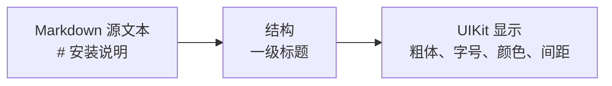
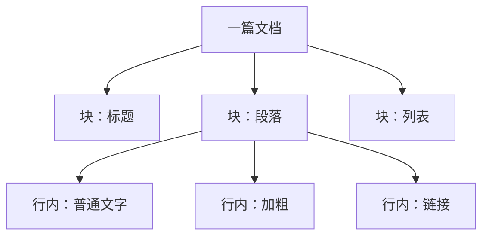
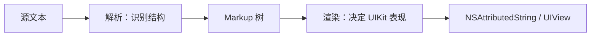

# 第 1 章：Markdown 从哪里开始

**难度**：零基础  
**预计时间**：45 分钟

## 本章目标

学完后，你可以：

- 用一句话解释 Markdown。
- 区分“源文本”“文档结构”和“最终界面”。
- 读写标题、段落、强调、链接、列表、引用和代码。
- 判断一种写法属于块级结构还是行内结构。

## 前置知识

会使用 Swift 字符串和 UIKit 控件即可。不需要 HTML、编译原理或数学知识。

## 1.1 先把 Markdown 当作“带便签的纯文本”

普通文本只写内容：

```text
安装说明
请先下载项目
```

Markdown 会用少量符号说明内容的角色：

```markdown
# 安装说明

请先 **下载项目**。
```

- `#` 表示“这是一级标题”。
- `**...**` 表示“这里需要强调”。
- 空行把标题和段落分开。

这些符号不是 UI。它们只描述结构。字体大小、颜色和间距由渲染器决定。



可以把它类比为 Auto Layout：约束描述关系，但最终 frame 由布局系统计算。Markdown 描述内容角色，但最终视觉由渲染器生成。

## 1.2 最常用语法

### 标题和段落

```markdown
# 一级标题
## 二级标题

这是一个段落。

这是另一个段落。
```

标题前的 `#` 数量表示级别，通常为 1 到 6。两个段落之间留一个空行。

### 强调和删除线

```markdown
这是 **加粗**，这是 *斜体*，这是 ~~删除线~~。
```

`~~删除线~~` 属于 GFM 扩展，不是最小 CommonMark 核心。InkMarkdown 当前能保留其中的文字，但删除线视觉仍以[语义规范](../spec/extended-syntax.md)为准。

### 链接和图片

```markdown
[Apple](https://www.apple.com)


```

方括号放可读文字，圆括号放目标地址。图片比链接多一个开头的 `!`。

InkMarkdown 当前会把链接渲染为可点击富文本；图片会降级为文字占位。这是项目当前的显示策略，不是 Markdown 标准的限制。

### 无序列表和有序列表

```markdown
- 下载项目
- 打开 Xcode
- 运行测试

1. 下载项目
2. 打开 Xcode
3. 运行测试
```

列表项可以包含嵌套内容。缩进和空行会影响归属，因此不要把所有空格都当作“仅用于排版”。

### 引用

```markdown
> 这是一段引用。
>
> 引用中也可以有 **强调**。
```

每行前的 `>` 表示该内容位于引用容器中。

### 行内代码和围栏代码块

````markdown
调用 `render(_:)` 得到富文本。

```swift
let result = InkAttributedRenderer.render("# Hello")
```
````

- 一对反引号包住行内代码。
- 三个反引号形成代码块围栏。
- `swift` 是语言提示。它不保证一定进行语法高亮。

### 分割线和任务列表

```markdown
---

- [x] 已完成
- [ ] 待完成
```

任务列表属于 GFM 扩展。`---` 在合适的上下文中会成为分割线，但 Markdown 的部分写法与上下文有关，不能只看一行字符就下结论。

## 1.3 块级和行内：先看“占多大位置”

这是后续读源码最重要的第一组概念。

### 块级结构

块级结构像垂直排列的 UIKit 子视图，通常独占一段区域：

- 标题
- 段落
- 列表
- 引用
- 代码块
- 表格
- 分割线

### 行内结构

行内结构像同一段 `NSAttributedString` 中不同样式的文字片段：

- 普通文字
- 加粗和斜体
- 行内代码
- 链接
- 图片标记
- 换行



这只是理解模型，不等于最终 UIKit 视图层级。InkMarkdown 可以把多个普通块合并成一个富文本视图，也可以把表格单独路由成 `UIView`。

## 1.4 解析和渲染不是一回事

把餐厅流程当作比喻：

- **源文本**：顾客写下的点菜单。
- **解析**：服务员识别“主食、饮料、备注”。
- **结构树**：整理后的订单。
- **渲染**：厨房和摆盘把订单变成真正的菜。

同一份结构可以有不同视觉。比如 `# 标题` 在两个 App 中都被解析为一级标题，但一个 App 用 24pt 黑字，另一个用 20pt 蓝字。



InkMarkdown 使用 swift-markdown 负责解析，自己负责 UIKit 渲染。

## 1.5 常见误区

### 误区一：Markdown 是一种字体样式

不是。Markdown 描述语义结构。字体、颜色和间距属于渲染层。

### 误区二：能看到文字就代表语法支持完整

不是。未知节点的子文字可能被保留下来，但专属视觉和交互可能没有实现。例如删除线文字存在，不代表已经有删除线 attribute。

### 误区三：每个换行都会变成界面换行

不一定。普通段落中的单个换行通常是 soft break，渲染器可以把它显示为空格。空行通常用于分隔块。

### 误区四：表格样式由 GFM 规定

GFM 规定怎样识别表格结构，不规定 UIKit 的圆角、颜色、滚动方式和列宽。

## 1.6 动手练习

把下面内容复制到 [CommonMark 交互式教程](https://commonmark.org/help/tutorial/) 或项目 ExampleApp：

````markdown
# 今日计划

先阅读 **InkMarkdown** 的文档，再查看 [swift-markdown](https://github.com/swiftlang/swift-markdown)。

- [x] 认识块级结构
- [ ] 认识 Markup 树

> 不需要一次记住所有语法。

```swift
let source = "# Hello"
```
````

尝试完成三件事：

1. 把一级标题改为二级标题。
2. 在第一段加入行内代码。
3. 在引用里加入一个链接。

## 完成标准

不看上文，尝试回答：

- Markdown 符号描述的是结构还是最终 UI？
- 标题和加粗，哪个通常是块级，哪个是行内？
- 解析器和渲染器分别负责什么？

如果你能用自己的话回答，就可以进入[第 2 章](02-commonmark-gfm-and-markup-tree.md)。

## 延伸阅读

- [CommonMark 交互式教程](https://commonmark.org/help/tutorial/)
- [项目常用语法规范](../spec/common-syntax.md)
- [项目扩展语法规范](../spec/extended-syntax.md)

