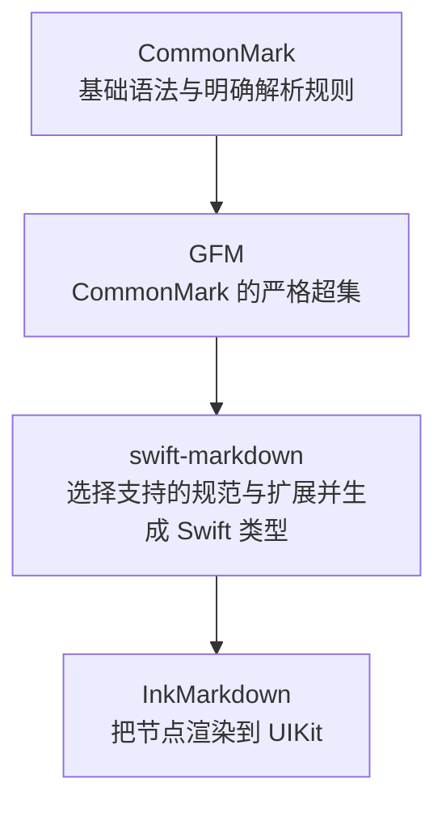
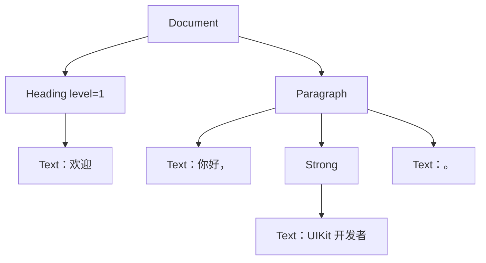
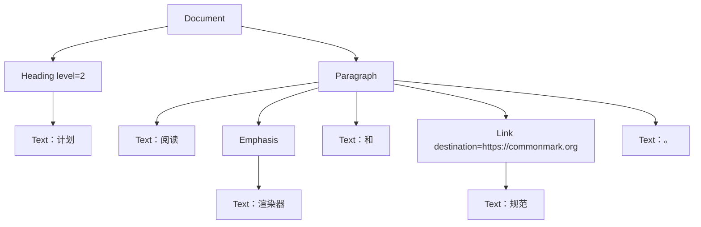

# 第 2 章：CommonMark、GFM 与 Markup 树

**难度**：初学者  
**预计时间**：60 分钟

## 本章目标

学完后，你可以：

- 解释 CommonMark、GFM 和 swift-markdown 的关系。
- 把一段简单 Markdown 画成 `Markup` 树。
- 区分容器节点和叶子节点。
- 使用 `debugDescription()` 观察真实解析结果。
- 理解为什么渲染器使用递归。

## 前置知识

完成[第 1 章](01-markdown-foundations.md)，能区分块级和行内结构。

## 2.1 为什么需要 CommonMark

早期 Markdown 的说明比较简短。不同工具遇到边界写法时，可能得出不同结果。CommonMark 提供了更精确、带大量示例的规范，让解析行为更一致。

可以把它类比为团队代码规范：大家都会写 Swift，但明确的规则能减少“我以为应该这样”的分歧。

CommonMark 主要回答：

> 给定这些字符和上下文，应当识别出什么文档结构？

它不回答：

> iOS 中应该用多大字号、什么颜色、哪个 UIView？

## 2.2 GFM 是什么

GFM 是 GitHub Flavored Markdown。它建立在 CommonMark 之上，并增加 GitHub 常用能力，例如：

- 表格
- 任务列表
- 删除线
- 扩展自动链接

这张列表描述 GFM 规范，不等于当前 swift-markdown 必然交付全部扩展。项目当前依赖源码在 `CommonMarkConverter` 中显式注册 `table`、`strikethrough` 和 `tasklist`。裸 URL 等扩展自动链接行为应根据当前依赖版本实测，不要只因为它“基于 GFM”就推断已支持。



“严格超集”可以简单理解为：GFM 保留 CommonMark 的规则，并在其上增加能力。

## 2.3 解析器为什么生成一棵树

看这段 Markdown：

```markdown
# 欢迎

你好，**UIKit 开发者**。
```

人类能看出：文档里有一个标题和一个段落；段落里有普通文字和加粗文字。解析器需要把这种包含关系明确记录下来。



这种结构叫树：

- 最上面是根节点 `Document`。
- 一个节点里面的内容是它的子节点 `children`。
- 没有子节点、直接保存内容的节点可视为叶子节点，例如 `Text`。
- 包含其他节点的节点可视为容器节点，例如 `Paragraph`、`Strong`。

AST 是 “Abstract Syntax Tree” 的缩写，中文常译为“抽象语法树”。在本项目里，先把它理解为“去掉原始符号细节后，保存内容结构的树”即可。swift-markdown 的节点共同遵循公开 `Markup` 协议，具体节点是值类型，因此项目文档常说 `Markup` 树。

## 2.4 两阶段解析：先搭房间，再摆家具

CommonMark 的解析过程可以用房屋比喻理解：

1. 先判断哪里是标题、段落、列表、引用和代码块。这像划分房间。
2. 再解析段落和标题内部的强调、链接、行内代码。这像在房间里摆家具。


这能解释一个常见现象：相同的 `*` 在不同上下文中可能是列表标记，也可能是强调标记。解析器不能脱离上下文只看一个字符。

## 2.5 在项目里观察真实树

InkMarkdown 的解析入口很薄：

```swift
import InkMarkdown

import Markdown

let document = InkParser.parse("# 欢迎\n\n你好，**UIKit 开发者**。")
print(document.debugDescription())
```

核心调用等价于：

```swift
let document = Document(parsing: source)
```

你应关注节点名字和缩进关系，不必记住调试输出的所有标点。不同 swift-markdown 版本的具体格式可能略有变化。

源码入口：

- `Sources/InkMarkdown/Parser/InkParser.swift`
- `Packages/Caches/swift-markdown/Sources/Markdown/`（本地缓存存在时）

## 2.6 Markup 节点速认

先记住常见角色和关键字段。完整类型层级与当前渲染状态放在 Reference，不在这里重复维护。

### 常见块节点

| Markdown 角色 | swift-markdown 节点 | 常用内容 |
| --- | --- | --- |
| 整篇文档 | `Document` | `children` |
| 标题 | `Heading` | `level`、行内子节点 |
| 段落 | `Paragraph` | 行内子节点 |
| 引用 | `BlockQuote` | 块级子节点 |
| 有序 / 无序列表 | `OrderedList` / `UnorderedList` | `ListItem` |
| 围栏代码 | `CodeBlock` | `code`、`language` |
| 分割线 | `ThematicBreak` | 无文字内容 |
| GFM 表格 | `Table` | 表头、行、单元格、对齐 |

### 常见行内节点

| Markdown 角色 | swift-markdown 节点 | 常用内容 |
| --- | --- | --- |
| 普通文字 | `Text` | `string` |
| 加粗 | `Strong` | 行内子节点 |
| 斜体 | `Emphasis` | 行内子节点 |
| 行内代码 | `InlineCode` | `code` |
| 链接 | `Link` | `destination`、子节点 |
| 图片 | `Image` | `source`、替代文字子节点 |
| 软换行 / 硬换行 | `SoftBreak` / `LineBreak` | 无子文字 |

完整状态请查 [swift-markdown API 速查](../references/swift-markdown-api-guide.md)，不要把这张初学表当作全部 API。

## 2.7 为什么递归很适合渲染树

递归可以先理解为：“处理当前盒子，再用同样的方法处理盒子里的每个小盒子。”

例如处理 `Strong`：

1. 取当前文字样式。
2. 在样式上增加粗体 trait。
3. 把新样式传给 `Strong` 的每个子节点。
4. `Text`、`InlineCode`、`Image` 等叶子根据当前 context 生成各自的富文本片段或降级内容。

伪代码如下：

```swift
func render(_ node: Markup, context: TextContext) -> NSAttributedString {
  if node is Strong {
    let boldContext = context.addingBold()
    return node.children.map { render($0, context: boldContext) }.joined()
  }

  if let text = node as? Text {
    return makeAttributedText(text.string, context: context)
  }

  return node.children.map { render($0, context: context) }.joined()
}
```

这段是帮助理解的伪代码，不是可直接复制的项目 API。真实实现位于 `InkAttributedRenderer.swift`。

## 2.8 Markup 树通常按不可变值使用

swift-markdown 的节点树采用不可变式设计。你通常读取节点并生成新结果，而不是随意修改原节点。需要改写树时，使用 `MarkupRewriter` 生成新树。

这与 UIKit 中“拿到一个 view 后直接改属性”不同。它更像根据旧的 view model 生成一个新的 view model。

InkMarkdown 当前渲染链没有默认插入 Rewriter。初学阶段先掌握读取 `children` 和按类型分派即可。

需要系统操作树时，按任务选协议：

| 任务 | 方式 |
| --- | --- |
| 少量节点递归渲染 | 遍历 `children` |
| 从树计算一个结果 | `MarkupVisitor` |
| 统计链接、标题等信息 | `MarkupWalker` |
| 删除或替换节点 | `MarkupRewriter` |

`MarkupWalker` 的自定义 `visitX` 方法如果还要继续向下，需要调用 `descendInto`。可运行示例见 [swift-markdown API 速查](../references/swift-markdown-api-guide.md#4-遍历)。

## 2.9 常见误区

### 误区一：源文本里每个符号都会出现在树里

不一定。`**文字**` 的星号用于表达结构，解析后重点是 `Strong` 和其中的 `Text`，不是两个星号文本节点。

### 误区二：节点树就是 UIView 树

不是。它是内容结构树。一个 `Paragraph` 不必对应一个独立 `UIView`，多个节点也可以合并进同一个 `NSAttributedString`。

### 误区三：解析出节点就代表项目已经完整显示它

不是。swift-markdown 能生成 `Strikethrough`，但 InkMarkdown 仍需实现对应的 attribute 才算完整渲染。

### 误区四：空行永远表示内容结束

列表、引用和围栏代码有自己的边界规则。流式输入中，当前结构还可能被后续字符改变。

## 2.10 动手练习

为下面内容手画一棵树：

```markdown
## 计划

阅读 *渲染器* 和 [规范](https://commonmark.org)。
```

至少应包含：

- `Document`
- `Heading`
- `Paragraph`
- `Text`
- `Emphasis`
- `Link`

然后使用 `InkParser.parse` 和 `debugDescription()` 对照。节点顺序或拆分与手画略有不同很正常，以真实解析结果为准。

<details>
<summary>参考答案</summary>



要点：

- `Heading` 的 `level` 是 2，因为源文本用了 `##`。
- `Emphasis`（斜体）和 `Link` 都是 `Paragraph` 的子节点，彼此是兄弟关系，不是嵌套关系。
- `Link` 自己也有子节点 `Text："规范"`，这是链接的可见文字；目标地址 `https://commonmark.org` 是 `Link` 节点的字段，不是单独的文字节点。
- 中文字符、空格和句号仍然是普通 `Text`，只是被 `Emphasis`、`Link` 前后的普通文字拆成了多段（"阅读 "、"和 "、"。"）。这种拆分与真实 `debugDescription()` 的具体切法可能略有出入，但角色关系应当一致。

</details>

## 完成标准

你能回答以下问题即可继续：

- CommonMark、GFM、swift-markdown、InkMarkdown 分别负责什么？
- 为什么 `Strong` 下面还会有 `Text`？
- Markup 树为什么不是 UIView 树？
- 为什么处理嵌套样式时适合递归？

## 官方资料

- [CommonMark 0.31.2 规范](https://spec.commonmark.org/0.31.2/)
- [GitHub Flavored Markdown 规范](https://github.github.com/gfm/)
- [swift-markdown 仓库](https://github.com/swiftlang/swift-markdown)
- [swift-markdown：Parsing, Building, and Modifying Markup Trees](https://github.com/swiftlang/swift-markdown/blob/main/Sources/Markdown/Markdown.docc/Parsing-Building-and-Modifying%20Markup-Trees.md)
- [swift-markdown：Visitors, Walkers, and Rewriters](https://github.com/swiftlang/swift-markdown/blob/main/Sources/Markdown/Markdown.docc/Visitors-Walkers-and-Rewriters.md)
- [项目 swift-markdown API 速查](../references/swift-markdown-api-guide.md)

## 下一步

- 继续[第 3 章：NSAttributedString 与 TextKit 1](03-nsattributedstring-and-textkit.md)。
- 如果还无法手画树，回到 [2.3 的最小示例](#23-解析器为什么生成一棵树)，先只画 `Document`、`Paragraph`、`Strong` 和 `Text`。
- 需要精确节点字段时，查 [swift-markdown API 速查](../references/swift-markdown-api-guide.md)。
