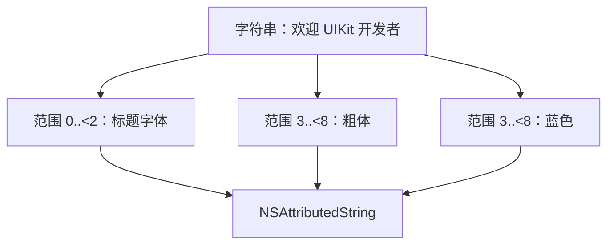
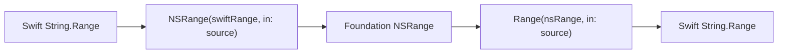
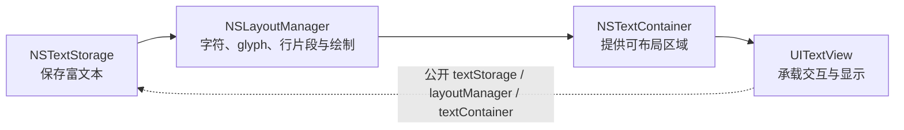
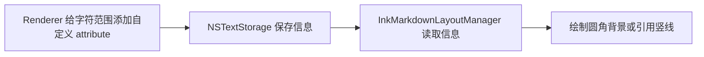

# 第 3 章：NSAttributedString 与 TextKit 1

**难度**：初学者  
**预计时间**：60 分钟

## 本章目标

学完后，你可以：

- 把 `NSAttributedString` 解释为“文字 + 作用范围 + 样式字典”。
- 看懂 attribute run 和 `NSRange`。
- 区分文本内容、文本存储、布局和绘制。
- 解释 TextKit 1 四个主要对象的关系。
- 找到 InkMarkdown 自定义行内代码背景和引用竖线的绘制位置。

## 前置知识

会使用 `UILabel`、`UITextView`、`UIFont`、`UIColor`。完成[第 2 章](02-commonmark-gfm-and-markup-tree.md)更容易理解后续映射。

## 3.1 NSAttributedString 是什么

普通 `String` 只保存文字。`NSAttributedString` 还会记录某段字符应该使用哪些属性。

可以把它想成一条透明胶带：

- 胶带上的字是字符串。
- 你可以圈出一段范围。
- 再贴上“粗体、蓝色、链接”等标签。



常见 attribute 包括：

- `.font`
- `.foregroundColor`
- `.paragraphStyle`
- `.link`
- `.underlineStyle`
- `.strikethroughStyle`
- `.attachment`
- 项目自定义 key

### 不要和 Swift AttributedString 混淆

Apple 还提供了没有 `NS` 前缀的 Swift `AttributedString`。它们都能表示带属性的文字，但不是同一个类型。

| 对比 | `NSAttributedString` | `AttributedString` |
| --- | --- | --- |
| 类型模型 | Foundation 引用类型 | Swift 值类型 |
| 最低 iOS | 3.2 | 15.0 |
| 常用范围 | `NSRange` | `AttributedString.Index` 和 Swift 范围 |
| InkMarkdown | 当前公开输出 | 当前不作为公开输出 |

InkMarkdown 支持 iOS 14 并面向 UIKit，因此使用 `NSAttributedString`。这是平台和 API 边界选择，不是说其中一个类型在所有项目中更好。精确 API 差异见 [Apple 文本系统速查](../references/apple-text-system-api-guide.md#区分两种-attributedstring)。

## 3.2 一个最小例子

```swift
import UIKit

let text = NSMutableAttributedString(string: "Hello UIKit")
let nsText = text.string as NSString
let range = nsText.range(of: "UIKit")

text.addAttributes(
  [
    .font: UIFont.boldSystemFont(ofSize: 17),
    .foregroundColor: UIColor.systemBlue,
  ],
  range: range
)

let textView = UITextView()
textView.attributedText = text
```

预期结果：`Hello ` 保持默认样式，`UIKit` 显示为蓝色粗体。

这里使用 `NSMutableAttributedString`，因为创建后还要添加属性。`NSAttributedString` 适合只读结果。

## 3.3 什么是 attribute run

run 不是新的类名。它是“在当前枚举方式下，属性保持不变的连续范围”。

假设最终文字是：

```text
普通 粗体 链接
```

可能被分成三个 run：

| run | 文字 | 主要属性 |
| --- | --- | --- |
| 1 | `普通 ` | 正文字体、正文色 |
| 2 | `粗体 ` | 粗体、正文色 |
| 3 | `链接` | 正文字体、链接色、URL |

当嵌套样式出现时，一个 run 可以同时有多个属性。例如“标题里的链接”同时需要标题字号和链接颜色。

`enumerateAttributes` 按完整属性字典不变的范围切分；`enumerateAttribute(.font, ...)` 只关心 `.font` 不变的范围。因此 run 不是脱离查询方式就永远固定的分块。

InkMarkdown 通过 `InkTextContext` 把当前字体、颜色和链接向子节点传递，最终在 `Text` 叶子一次性生成正确 run。这能减少父节点事后覆盖子节点样式的问题。

## 3.4 NSRange：只把它当作“位置 + 长度”

`NSRange(location:length:)` 表示从哪里开始、覆盖多少个文本单元。

```swift
let range = NSRange(location: 6, length: 5)
```

初学阶段最重要的安全规则是：不要用 Swift 的 `String.count` 手算复杂文本的 `NSRange`。Emoji、组合字符和 UTF-16 会让“人眼看到的字符数”与 Foundation 范围单位不同。

优先使用 Foundation 帮你转换：

```swift
let source = "你好 👋 UIKit"
let swiftRange = source.range(of: "UIKit")!
let nsRange = NSRange(swiftRange, in: source)
```

或者在纯 Foundation 查找中使用 `NSString.range(of:)`。当你遍历 `NSAttributedString` 的 attributes 时，系统回调也会直接给出正确 `NSRange`。



这里不需要学习编码数学。记住“不要凭肉眼手算 Emoji 范围”即可。

## 3.5 段落属性和字符属性不同

字体、颜色、链接通常作用于字符片段。行高、缩进、段后距通常属于 `NSMutableParagraphStyle`。

```swift
let paragraph = NSMutableParagraphStyle()
paragraph.minimumLineHeight = 28
paragraph.maximumLineHeight = 28
paragraph.paragraphSpacing = 12

text.addAttribute(
  .paragraphStyle,
  value: paragraph,
  range: NSRange(location: 0, length: text.length)
)
```

InkMarkdown 同时设置最小和最大行高，把行盒锁定为固定高度；再按每个 run 的字体计算 `baselineOffset`，让不同字号的文字在行内更稳定地垂直居中。

段落样式应覆盖完整段落，不要只给其中几个字符添加 `.paragraphStyle`。InkMarkdown 先对整段结果设置 paragraph style，再按字体有效范围设置 `baselineOffset`。

你暂时不需要记计算式。只需知道：

- paragraph style 决定整段排版规则。
- font 决定字形大小。
- baseline offset 微调文字在行盒中的上下位置。

## 3.6 NSAttributedString 不负责真正布局

富文本只是内容和属性。它本身不知道可用宽度，也不会决定在哪里折行或画到屏幕哪个位置。

TextKit 负责文本存储、字形布局和绘制。InkMarkdown 当前正式使用 TextKit 1 路径。



### `NSTextStorage`

它是可编辑的富文本存储，并会通知布局系统内容或 attributes 发生变化。

### `NSLayoutManager`

它把字符映射为用于显示的 glyph，计算行片段，并负责绘制。你可以继承它添加特殊背景。

glyph 可以先理解为“实际画出来的字形”。一个用户看到的字符不保证永远对应一个 glyph，初学阶段不要依赖一对一关系。

### `NSTextContainer`

它描述文字可以排版的区域，例如宽度、无限高度和行片段内边距。

### `UITextView`

它把上述系统封装成可滚动、可选择、可交互的 UIKit 视图。也可以像项目一样传入自建 `NSTextContainer` 来使用自定义布局管理器。

## 3.7 InkMarkdown 怎样接入 TextKit 1

`InkAttributedTextBlock.makeView()` 的简化流程如下：

```swift
let textContainer = NSTextContainer(
  size: CGSize(width: 0, height: CGFloat.greatestFiniteMagnitude)
)
let layoutManager = InkMarkdownLayoutManager()
layoutManager.addTextContainer(textContainer)

let textStorage = NSTextStorage(attributedString: attributedText)
textStorage.addLayoutManager(layoutManager)

let textView = UITextView(frame: .zero, textContainer: textContainer)
```

项目实际使用 `InkAttributedBlockTextView`，以便处理业务链接点击。上面的片段只展示 TextKit 连接顺序。

这条自定义 TextKit 1 链只在 `InkAttributedTextBlock.makeView()` 中明确安装。如果宿主只把 `InkAttributedRenderer.render` 的结果放进任意 `UITextView`，字体、颜色、段落和 `.link` 等标准 attribute 仍然存在，但项目自定义圆角代码背景和引用竖线不保证出现。

对应源码：

- `Sources/InkMarkdown/Rendering/Block/InkAttributedTextBlock.swift`
- `Sources/InkMarkdown/Rendering/Components/InkMarkdownLayoutManager.swift`

## 3.8 为什么项目需要自定义 attribute

UIKit 内建的 `.backgroundColor` 能请求普通矩形背景，但 InkMarkdown 的行内代码需要圆角、横向扩展和可选固定高度。引用还需要沿多行文字画竖线。

项目先把“应该怎样画”的信息挂在文字范围上：

```swift
.inkInlineCodeBackground -> InkInlineCodeBackgroundInfo
.inkBlockquoteBar -> InkBlockquoteBarInfo
```

`InkMarkdownLayoutManager` 根据两种不同的 TextKit 1 绘制回调处理它们：

- 行内代码同时带 `.backgroundColor` 和 `.inkInlineCodeBackground`。系统请求背景绘制时，`fillBackgroundRectArray` 读取自定义信息，将普通背景改画为圆角形状。
- 引用竖线由 `drawBackground` 主动枚举 `.inkBlockquoteBar` 范围，再按行片段高度绘制。



这是一种“先描述，后绘制”的设计：渲染器不直接拿 `CGContext` 画图，布局管理器也不重新猜测哪个文本是代码。

## 3.9 区分项目当前实现与 Apple 通用要求

本章解释的固定 pt 字号、固定行高和 TextKit 1 绘制是项目当前实现，不是完整的 Apple 文本可访问性方案。

通用 UIKit 产品还应考虑 Dynamic Type、`UIFontMetrics`、VoiceOver 标题语义、自定义 block 的读取顺序与大字体裁切。这些当前属于[路线图的可访问性工作](../roadmap.md)，不应把“视觉上是粗体标题”写成“已具有完整标题可访问性语义”。

## 3.10 如何检查一段富文本的 attributes

调试时不要只看最终 UI。可以直接枚举每个 run：

```swift
let result = InkAttributedRenderer.render("你好，**UIKit**")
let fullRange = NSRange(location: 0, length: result.length)

result.enumerateAttributes(in: fullRange) { attributes, range, _ in
  let text = result.attributedSubstring(from: range).string
  print(range, text, attributes)
}
```

预期能看到普通文字和粗体文字至少具有不同字体属性。控制台具体字典内容会随系统版本变化，因此测试应验证关键语义，不要依赖完整 `description` 字符串。

## 3.11 常见误区

### 误区一：一个 Markdown 节点等于一个 attribute run

不一定。嵌套样式、段落属性和相邻相同属性可能让 run 的边界与节点边界不同。

### 误区二：设置富文本就不需要 TextKit

`UILabel`、`UITextView` 内部仍需要文本布局和绘制系统。`NSAttributedString` 不是屏幕上的像素。

### 误区三：字符范围与 glyph 范围永远相同

不一定。`NSLayoutManager` 同时提供字符范围和 glyph 范围转换 API。自定义绘制时要使用正确空间。

### 误区四：TextKit 2 更新，所以项目必须立刻迁移

项目当前自定义绘制建立在 `NSLayoutManager` 上，正式路径是 TextKit 1。是否迁移需要单独评估兼容性和收益，不属于“越新越好”的简单判断。

## 3.12 动手练习

1. 创建文字 `"普通 粗体 链接"`。
2. 给“粗体”添加 bold font。
3. 给“链接”添加 `.link` 和 `.foregroundColor`。
4. 使用 `enumerateAttributes` 打印 run。
5. 把它显示在 `UITextView`，比较控制台范围与界面效果。

然后回答：如果要给“链接”加蓝色，应该改字符串、改 attribute，还是改 TextKit 容器宽度？正确答案是 attribute。

## 完成标准

你能用自己的话说明：

- `NSAttributedString` 保存哪三类信息？
- 为什么不要用 `String.count` 手算 Emoji 的 `NSRange`？
- `NSTextStorage`、`NSLayoutManager`、`NSTextContainer`、`UITextView` 各做什么？
- InkMarkdown 的自定义 attribute 为什么需要 LayoutManager 配合？

## 官方资料

- [Apple：NSAttributedString](https://developer.apple.com/documentation/foundation/nsattributedstring)
- [Apple：AttributedString](https://developer.apple.com/documentation/foundation/attributedstring)
- [Apple：UITextView](https://developer.apple.com/documentation/uikit/uitextview)
- [Apple：NSTextStorage](https://developer.apple.com/documentation/uikit/nstextstorage)
- [Apple：NSLayoutManager](https://developer.apple.com/documentation/uikit/nslayoutmanager)
- [Apple：NSTextContainer](https://developer.apple.com/documentation/uikit/nstextcontainer)
- [Apple：TextKit](https://developer.apple.com/documentation/uikit/textkit)
- [Apple 归档：Attributed String Programming Guide](https://developer.apple.com/library/archive/documentation/Cocoa/Conceptual/AttributedStrings/AttributedStrings.html)
- [项目：Apple 文本系统 API 速查](../references/apple-text-system-api-guide.md)

## 下一步

- 继续[第 4 章：完整渲染管线](04-inkmarkdown-render-pipeline.md)。
- 如果还会混淆内容与布局，回看 [3.6 的 TextKit 图](#36-nsattributedstring-不负责真正布局)。
- 需要精确类型、可用版本或排查路径时，查 [Apple 文本系统 API 速查](../references/apple-text-system-api-guide.md)。
