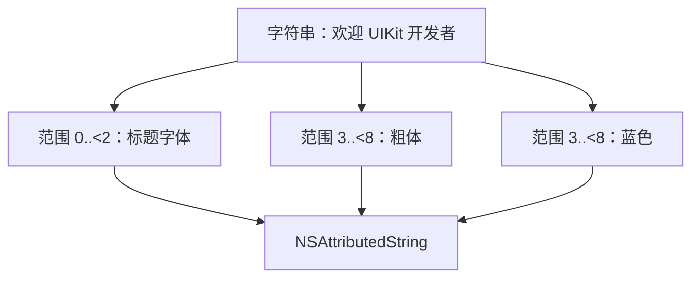
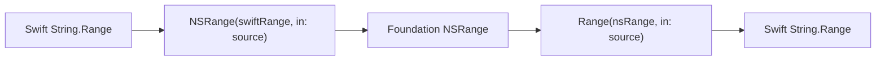
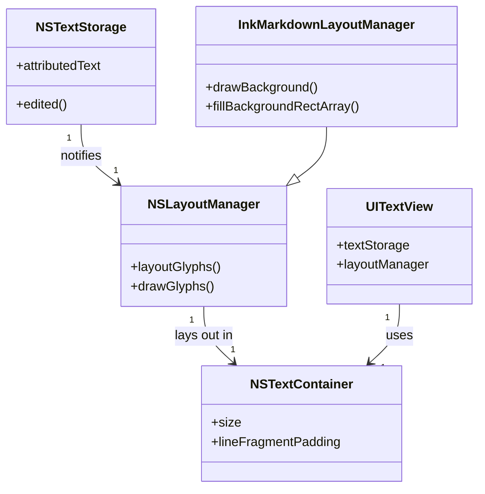
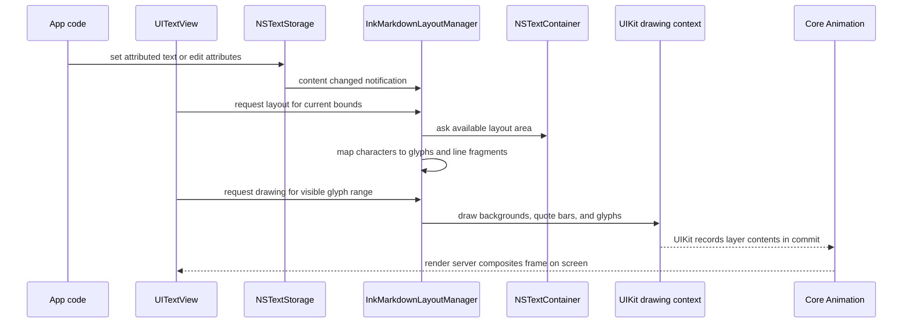
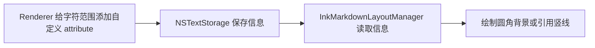

# 第 3 章：NSAttributedString 与 TextKit 1

**难度**：初学者  
**预计时间**：60 分钟

## 本章目标

学完后，你可以：

- 把 `NSAttributedString` 解释为“文字 + 作用范围 + 样式字典”。
- 看懂 attribute run 和 `NSRange`。
- 区分文本内容、文本存储、布局和绘制。
- 解释 TextKit 1 四个主要对象的关系。
- 找到 InkMarkdown 自定义行内代码背景和引用竖线的绘制位置。

## 前置知识

会使用 `UILabel`、`UITextView`、`UIFont`、`UIColor`。完成[第 2 章](02-commonmark-gfm-and-markup-tree.md)更容易理解后续映射。

## 3.1 NSAttributedString 是什么

普通 `String` 只保存字符序列。`NSAttributedString` 保存字符序列，以及每个字符范围关联的 attribute（属性）。这使同一段文字能在不同位置呈现不同的外观和行为，是它成为 UIKit 富文本主要载体的原因。

一个 attribute 不只有“样式”。常见类别如下：

| 类别 | 常见 attribute | 它解决的问题 |
| --- | --- | --- |
| 字形与颜色 | `.font`、`.foregroundColor`、`.kern`、`.baselineOffset` | 用什么字体、颜色、字距和基线位置显示字符 |
| 修饰与背景 | `.underlineStyle`、`.strikethroughStyle`、`.backgroundColor` | 下划线、删除线和普通矩形背景 |
| 段落排版 | `.paragraphStyle` | 行高、对齐、缩进、换行和段前段后距离 |
| 行为与嵌入内容 | `.link`、`.attachment` | 链接目标，或在文字中嵌入图片等对象 |
| 自定义语义 | 项目自定义 key | 告诉后续组件“这段是句中代码”或“这里要画引用竖线” |

attribute 的值并不一定是颜色或数字。`.font` 的值是 `UIFont`，`.paragraphStyle` 的值是段落样式对象，`.link` 的值通常是 `URL`。因此，`NSAttributedString` 更准确的模型是“字符范围到信息的映射”。

可以把它想成一条透明胶带：

- 胶带上的字是字符串。
- 你可以圈出一段范围。
- 再贴上“粗体、蓝色、链接”等标签。



### 不要和 Swift AttributedString 混淆

Apple 还提供了没有 `NS` 前缀的 Swift `AttributedString`。它们都能表示带属性的文字，但不是同一个类型。

| 对比 | `NSAttributedString` | `AttributedString` |
| --- | --- | --- |
| 类型模型 | Foundation 引用类型 | Swift 值类型 |
| 最低 iOS | 3.2 | 15.0 |
| 常用范围 | `NSRange` | `AttributedString.Index` 和 Swift 范围 |
| InkMarkdown | 当前公开输出 | 当前不作为公开输出 |

InkMarkdown 支持 iOS 14 并面向 UIKit，因此使用 `NSAttributedString`。这是平台和 API 边界选择，不是说其中一个类型在所有项目中更好。精确 API 差异见 [Apple 文本系统速查](../references/apple-text-system-api-guide.md#区分两种-attributedstring)。

## 3.2 一个最小例子

```swift
import UIKit

let text = NSMutableAttributedString(string: "Hello UIKit")
let nsText = text.string as NSString
let range = nsText.range(of: "UIKit")

text.addAttributes(
  [
    .font: UIFont.boldSystemFont(ofSize: 17),
    .foregroundColor: UIColor.systemBlue,
  ],
  range: range
)

let textView = UITextView()
textView.attributedText = text
```

预期结果：`Hello ` 保持默认样式，`UIKit` 显示为蓝色粗体。

这里使用 `NSMutableAttributedString`，因为创建后还要添加属性。`NSAttributedString` 适合只读结果。

## 3.3 什么是 attribute run

run 不是新的类名。它是“在当前枚举方式下，属性保持不变的连续范围”。

假设最终文字是：

```text
普通 粗体 链接
```

可能被分成三个 run：

| run | 文字 | 主要属性 |
| --- | --- | --- |
| 1 | `普通 ` | 正文字体、正文色 |
| 2 | `粗体 ` | 粗体、正文色 |
| 3 | `链接` | 正文字体、链接色、URL |

当嵌套样式出现时，一个 run 可以同时有多个属性。例如“标题里的链接”同时需要标题字号和链接颜色。

`enumerateAttributes` 按完整属性字典不变的范围切分；`enumerateAttribute(.font, ...)` 只关心 `.font` 不变的范围。因此 run 不是脱离查询方式就永远固定的分块。

InkMarkdown 通过 `InkTextContext` 把当前字体、颜色和链接向子节点传递，最终在 `Text` 叶子一次性生成正确 run。这能减少父节点事后覆盖子节点样式的问题。

## 3.4 NSRange：只把它当作“位置 + 长度”

`NSRange(location:length:)` 表示从哪里开始、覆盖多少个文本单元。

```swift
let range = NSRange(location: 6, length: 5)
```

初学阶段最重要的安全规则是：不要用 Swift 的 `String.count` 手算复杂文本的 `NSRange`。Emoji、组合字符和 UTF-16 会让“人眼看到的字符数”与 Foundation 范围单位不同。

优先使用 Foundation 帮你转换：

```swift
let source = "你好 👋 UIKit"
let swiftRange = source.range(of: "UIKit")!
let nsRange = NSRange(swiftRange, in: source)
```

或者在纯 Foundation 查找中使用 `NSString.range(of:)`。当你遍历 `NSAttributedString` 的 attributes 时，系统回调也会直接给出正确 `NSRange`。



这里不需要学习编码数学。记住“不要凭肉眼手算 Emoji 范围”即可。

## 3.5 段落属性和字符属性不同

字体、颜色、链接通常作用于字符片段。行高、缩进、段后距通常属于 `NSMutableParagraphStyle`。

```swift
let paragraph = NSMutableParagraphStyle()
paragraph.minimumLineHeight = 28
paragraph.maximumLineHeight = 28
paragraph.paragraphSpacing = 12

text.addAttribute(
  .paragraphStyle,
  value: paragraph,
  range: NSRange(location: 0, length: text.length)
)
```

InkMarkdown 同时设置最小和最大行高，把行盒锁定为固定高度；再按每个 run 的字体计算 `baselineOffset`，让不同字号的文字在行内更稳定地垂直居中。

段落样式应覆盖完整段落，不要只给其中几个字符添加 `.paragraphStyle`。InkMarkdown 先对整段结果设置 paragraph style，再按字体有效范围设置 `baselineOffset`。

你暂时不需要记计算式。只需知道：

- paragraph style 决定整段排版规则。
- font 决定字形大小。
- baseline offset 微调文字在行盒中的上下位置。

## 3.6 NSAttributedString 不负责真正布局

先把三个容易混淆的词分开：

- **文本内容**：你要表达的字符，例如 `"你好 UIKit"`。这里的“内容”和日常所说的“文本”没有本质差别，前者强调字符本身和语义，后者是更宽泛的叫法。
- **富文本**：文本内容加上“哪段文字有什么 attribute”。`NSAttributedString` 是 UIKit/Foundation 中承载富文本的一种具体类型，而不是“富文本”这个概念本身。HTML、RTF 和 Swift `AttributedString` 也能表示富文本。
- **文本存储**：TextKit 1 中的 `NSTextStorage`。它保存可变富文本，并把修改通知给布局系统；它不是另一份不同的“内容”。

因此，`NSAttributedString` 本身不知道可用宽度，也不会决定在哪里折行或画到屏幕哪个位置。TextKit 1 让 `NSTextStorage`、`NSLayoutManager` 和 `NSTextContainer` 分工完成这些事；`UITextView` 把这条链包装成可显示、选择和交互的视图。

InkMarkdown 当前正式使用 TextKit 1 路径。下面的类图描述对象关系；箭头表示主要持有或连接关系，不表示所有对象都直接继承彼此。



### 一次显示是怎样发生的

`NSLayoutManager` 会把字符映射为 glyph（字形）。glyph 是排版和绘制使用的形状单位，不等于“一个 Swift `Character`”：一个字符可能由多个 glyph 组成，也可能和相邻字符共同形成一个 glyph。

一个具体例子：把重音字母 “é” 写成分解形式，即字母 `e`（U+0065）后面紧跟一个组合尖音符（COMBINING ACUTE ACCENT，U+0301）。这两个 Unicode 标量在 Swift 里会被识别成同一个 extended grapheme cluster，所以 `"e\u{0301}".count == 1`——只有 1 个 Swift `Character`，`NSString` 长度也只是 2 个 UTF-16 code unit（`e` 和组合符号各占 1 个，都在 BMP 内，不涉及 surrogate pair）。但排版时，多数系统字体仍然要用 2 个 glyph 才能画出它：一个是字母 `e` 本身的字形，另一个是叠放在其上方、由 mark positioning 定位的重音符号字形。也就是说，这里是“1 个 Character 对应 2 个 glyph”；换成更复杂的组合 Emoji 序列（例如带 ZWJ 连接的家庭表情），实际 glyph 数量还会因字体是否支持该组合而变化，甚至可能回退成好几个独立 glyph 并排显示。

它再把能放进同一行的一段 glyph 放进一个 **行片段**（line fragment）。行片段可以理解为排版系统分配给某一行的矩形区域；其中的 `usedRect` 是该行文字实际占用的部分。短行右侧的空白仍属于行片段，但不属于 `usedRect`。



这里的“绘制”指 UIKit/TextKit 在当前绘图上下文中执行画字形、填背景等操作。它不是“先给文字做一个标记，等 RunLoop 再绘制”的同义词：attribute 是更早的描述数据，布局管理器在需要显示时读取它。通常在本轮 RunLoop 的提交阶段，Core Animation 会把视图更新提交给渲染服务完成合成并显示。日常讨论中常把整个过程都叫“渲染”；本章刻意把“布局”“绘制”“合成显示”分开，排查问题时会更准确。

### `NSTextStorage`

它是可编辑的富文本存储，并会通知布局系统内容或 attributes 发生变化。

### `NSLayoutManager`

它把字符映射为用于显示的 glyph，计算行片段，并负责绘制。你可以继承它添加特殊背景。

glyph 可以先理解为“实际画出来的字形”。一个用户看到的字符不保证永远对应一个 glyph，初学阶段不要依赖一对一关系。

### `NSTextContainer`

它描述文字可以排版的区域，例如宽度、无限高度和行片段内边距。

### `UITextView`

它把上述系统封装成可滚动、可选择、可交互的 UIKit 视图。也可以像项目一样传入自建 `NSTextContainer` 来使用自定义布局管理器。

## 3.7 InkMarkdown 怎样接入 TextKit 1

`InkAttributedTextBlock.makeView()` 的简化流程如下：

```swift
let textContainer = NSTextContainer(
  size: CGSize(width: 0, height: CGFloat.greatestFiniteMagnitude)
)
let layoutManager = InkMarkdownLayoutManager()
layoutManager.addTextContainer(textContainer)

let textStorage = NSTextStorage(attributedString: attributedText)
textStorage.addLayoutManager(layoutManager)

let textView = UITextView(frame: .zero, textContainer: textContainer)
```

项目实际使用 `InkAttributedBlockTextView`，以便处理业务链接点击。上面的片段只展示 TextKit 连接顺序。

这条自定义 TextKit 1 链只在 `InkAttributedTextBlock.makeView()` 中明确安装。如果宿主只把 `InkAttributedRenderer.render` 的结果放进任意 `UITextView`，字体、颜色、段落和 `.link` 等标准 attribute 仍然存在，但项目自定义圆角代码背景和引用竖线不保证出现。

对应源码：

- `Sources/InkMarkdown/Rendering/Block/InkAttributedTextBlock.swift`
- `Sources/InkMarkdown/Rendering/Components/InkMarkdownLayoutManager.swift`

## 3.8 为什么项目需要自定义 attribute

先定义一个术语：**句中代码**是嵌在普通句子中的短代码，例如“调用 `render()`”。Markdown 与 Apple 文档通常称它为 *inline code*；本章后面优先使用“句中代码”，以便和独占一整块区域的“围栏代码块”区分。

UIKit 内建的 `.backgroundColor` 能请求普通矩形背景，但 InkMarkdown 的句中代码需要圆角、左右内边距和可选固定高度。引用还需要沿多行文字画竖线。

“左右内边距”就是原文“横向扩展”的准确含义：背景矩形的左、右边缘各向外延伸 `insets` 点，文字不会紧贴背景边缘。它不改变代码字符串的宽度，也不让文本横向缩放。圆角指背景色区域的四角，而不是字形本身；`InkMarkdownLayoutManager` 用 `UIBezierPath(roundedRect:)` 画它。

你在 ExampleApp 里看到的独立代码块，和句中代码不是同一条实现路径。独立代码块由 `InkCodeBlockView` 创建 `UIView` 容器并应用 `InkAppearance.CodeBlock.cornerRadius`；句中代码由 `InkMarkdownLayoutManager` 在文本行中绘制。两者默认圆角都是 `4`，但由于尺寸、颜色和屏幕缩放，视觉上可能看起来接近直角，也都可分别配置。

项目先把“应该怎样画”的信息挂在文字范围上：

```swift
.inkInlineCodeBackground -> InkInlineCodeBackgroundInfo
.inkBlockquoteBar -> InkBlockquoteBarInfo
```

`InkMarkdownLayoutManager` 根据两种不同的 TextKit 1 绘制回调处理它们：

- 行内代码同时带 `.backgroundColor` 和 `.inkInlineCodeBackground`。系统请求背景绘制时，`fillBackgroundRectArray` 读取自定义信息，将普通背景改画为圆角形状。
- 引用竖线由 `drawBackground` 主动枚举 `.inkBlockquoteBar` 范围，再按行片段高度绘制。



这是一种“先描述，后绘制”的设计。渲染器在没有宽度、换行结果和绘图上下文时，只写入“这段是句中代码，背景参数是这些”；布局管理器在拿到实际行片段和 `CGContext` 后，再按这个信息绘制。布局管理器不需要从字体或字符串内容猜测“哪段是代码”。

### 为什么不用其他设计

| 设计 | 最小示例 | 优点 | 局限 |
| --- | --- | --- | --- |
| 只使用系统背景 | `text.addAttribute(.backgroundColor, value: color, range: range)` | 代码少；标准 `UITextView` 就能显示 | 只能得到系统矩形背景，不能可靠画圆角、左右内边距或引用竖线 |
| 渲染器直接 `CGContext` 绘制 | `context.fill(rect)` | 看起来直接 | 渲染器阶段没有视图宽度、换行结果和 UIKit 绘图上下文；它还会把语义转换和视图绘制耦合在一起 |
| 给每个代码片段放一个 `UIView` | `stackView.addArrangedSubview(codeView)` | 独立代码块很好做，也适合按钮等独立组件 | 句中代码需要与文字一起自动换行、选择和复制；把它拆成 View 会破坏连续文本布局 |
| **自定义 attribute + LayoutManager** | 下例 | 保留连续富文本和 TextKit 的换行/选择；能按实际行片段定制绘制 | 需要维护一个自定义 `NSLayoutManager`，且要通过项目的 TextKit 1 链显示 |

下面两段代码展示差别。第一段只使用系统能力，任何 `UITextView` 都能显示，但背景是普通矩形：

```swift
import UIKit

let text = NSMutableAttributedString(string: "调用 render()")
let codeRange = (text.string as NSString).range(of: "render()")
text.addAttribute(.backgroundColor, value: UIColor.secondarySystemFill, range: codeRange)
```

第二段是项目使用的语义标记。只有把结果交给 `InkAttributedTextBlock` 的 TextKit 1 链后，`InkMarkdownLayoutManager` 才会读取 `.inkInlineCodeBackground` 并按行片段画圆角背景：

```swift
import UIKit
import InkMarkdown

let rendered = InkAttributedRenderer.render("调用 `render()`")
let block = InkAttributedTextBlock(attributedText: rendered)
let textView = block.makeView() as! UITextView
```

## 3.9 区分项目当前实现与 Apple 通用要求

本章解释的固定 pt 字号、固定行高和 TextKit 1 绘制是项目当前实现，不是完整的 Apple 文本可访问性方案。

通用 UIKit 产品还应考虑 Dynamic Type、`UIFontMetrics`、VoiceOver 标题语义、自定义 block 的读取顺序与大字体裁切。这些当前属于[路线图的可访问性工作](../roadmap.md)，不应把“视觉上是粗体标题”写成“已具有完整标题可访问性语义”。

## 3.10 如何检查一段富文本的 attributes

这个章节用于验证“渲染器是否写对了数据”。最终 UI 正确不一定代表 attributes 正确：例如系统默认颜色碰巧和链接色相同，或者你把富文本放进了没有自定义布局管理器的 `UITextView`，标准样式仍会显示，但句中代码的自定义绘制会丢失。枚举 attributes 能把问题定位在“渲染数据”“TextKit 布局”还是“视图交互”三层中的哪一层。

调试时可以直接枚举每个 run：

```swift
let result = InkAttributedRenderer.render("你好，**UIKit**")
let fullRange = NSRange(location: 0, length: result.length)

result.enumerateAttributes(in: fullRange) { attributes, range, _ in
  let text = result.attributedSubstring(from: range).string
  print(range, text, attributes)
}
```

预期能看到普通文字和粗体文字至少具有不同字体属性。项目测试也用这个方式确认句中代码同时保留自定义背景标记和等宽字体：

```swift
import Testing
import UIKit
@testable import InkMarkdown

@Test func inlineCode_hasCustomBackgroundMarker() {
  let result = InkAttributedRenderer.render("列表中的 `config`")
  let range = NSRange(location: 0, length: result.length)
  var foundCodeMarker = false

  result.enumerateAttributes(in: range) { attributes, _, _ in
    if attributes[.inkInlineCodeBackground] is InkInlineCodeBackgroundInfo {
      foundCodeMarker = true
    }
  }

  #expect(foundCodeMarker)
}
```

“不要依赖完整 `description` 字符串”是指不要写出这种脆弱测试：`#expect(result.description == "...")`，或比较 `print(attributes)` 得到的一整行日志。`description` 只是调试用的文字表示，字典键的顺序、颜色对象的打印格式和系统附加的内部属性都可能随 SDK 或系统版本变化。测试应该只断言你真正关心的语义，例如“代码范围有 `.inkInlineCodeBackground`”“链接范围有正确的 URL”“标题范围使用预期字号”。

## 3.11 常见误区

### 误区一：一个 Markdown 节点等于一个 attribute run

不一定。嵌套样式、段落属性和相邻相同属性可能让 run 的边界与节点边界不同。

### 误区二：设置富文本就不需要 TextKit

`UILabel`、`UITextView` 内部仍需要文本布局和绘制系统。`NSAttributedString` 不是屏幕上的像素。

### 误区三：字符范围与 glyph 范围永远相同

不一定。`NSLayoutManager` 同时提供字符范围和 glyph 范围转换 API。自定义绘制时要使用正确空间。

### 误区四：TextKit 2 更新，所以项目必须立刻迁移

项目当前自定义绘制建立在 `NSLayoutManager` 上，正式路径是 TextKit 1。是否迁移需要单独评估兼容性和收益，不属于“越新越好”的简单判断。

## 3.12 动手练习

1. 创建文字 `"普通 粗体 链接"`。
2. 给“粗体”添加 bold font。
3. 给“链接”添加 `.link` 和 `.foregroundColor`。
4. 使用 `enumerateAttributes` 打印 run。
5. 把它显示在 `UITextView`，比较控制台范围与界面效果。

然后回答：如果要给“链接”加蓝色，应该改字符串、改 attribute，还是改 TextKit 容器宽度？正确答案是 attribute。

<details>
<summary>参考答案</summary>

按步骤操作后，`enumerateAttributes` 应该打印出 3 个 run（对照 3.3 节的 run 表格）：

| run | 文字 | 关键 attributes |
| --- | --- | --- |
| 1 | `普通 ` | `.font`：默认系统字体（未特别设置时的初始字体） |
| 2 | `粗体 ` | `.font`：`UIFont.boldSystemFont` |
| 3 | `链接` | `.link`：你设置的 URL；`.foregroundColor`：你设置的颜色（例如 `.systemBlue`） |

要点：

- 只要“粗体”和“链接”各自的字体/颜色/link 值和相邻文字不同，`enumerateAttributes` 就会在这两处产生新的 run 边界，因此至少切出 3 段。
- 如果“粗体”只设置了 `.font` 而没有改颜色，它的 `.foregroundColor` 会保持和“普通 ”一样——这正常，run 的切分看的是**完整属性字典**是否相同，不要求每个属性都不同。
- 显示到 `UITextView` 后，界面上蓝色链接文字的范围应该和控制台打印的第 3 个 run 范围一致；如果两者对不上，通常是 attribute 设置的 `range` 算错了，可以回看 3.4 节的 `NSRange` 用法。
- 最后一个问题的答案是 **attribute**：字符串内容和 TextKit 容器宽度都不负责颜色，颜色只由 `.foregroundColor` 这个 attribute 决定。

</details>

## 完成标准

你能用自己的话说明：

- `NSAttributedString` 保存哪三类信息？
- 为什么不要用 `String.count` 手算 Emoji 的 `NSRange`？
- `NSTextStorage`、`NSLayoutManager`、`NSTextContainer`、`UITextView` 各做什么？
- InkMarkdown 的自定义 attribute 为什么需要 LayoutManager 配合？

## 下一步

- 继续[第 4 章：完整渲染管线](04-inkmarkdown-render-pipeline.md)。
- 如果还会混淆内容与布局，回看 [3.6 的 TextKit 图](#36-nsattributedstring-不负责真正布局)。
- 需要精确类型、可用版本或排查路径时，查 [Apple 文本系统 API 速查](../references/apple-text-system-api-guide.md)。

## 参考资料

### Apple 官方文档

- [NSAttributedString](https://developer.apple.com/documentation/foundation/nsattributedstring)
- [AttributedString](https://developer.apple.com/documentation/foundation/attributedstring)
- [UITextView](https://developer.apple.com/documentation/uikit/uitextview)
- [NSTextStorage](https://developer.apple.com/documentation/uikit/nstextstorage)
- [NSLayoutManager](https://developer.apple.com/documentation/uikit/nslayoutmanager)
- [NSTextContainer](https://developer.apple.com/documentation/uikit/nstextcontainer)
- [TextKit](https://developer.apple.com/documentation/uikit/textkit)
- [Attributed String Programming Guide（归档）](https://developer.apple.com/library/archive/documentation/Cocoa/Conceptual/AttributedStrings/AttributedStrings.html)

### 项目资料与实现

- [Apple 文本系统 API 速查](../references/apple-text-system-api-guide.md)
- [`InkMarkdownLayoutManager.swift`](../../Sources/InkMarkdown/Rendering/Components/InkMarkdownLayoutManager.swift)
- [`InkAttributedTextBlock.swift`](../../Sources/InkMarkdown/Rendering/Block/InkAttributedTextBlock.swift)
- [`InkAttributedRenderer.swift`](../../Sources/InkMarkdown/Rendering/AttributedString/InkAttributedRenderer.swift)
- [`InkCodeBlockView.swift`](../../Sources/InkMarkdown/Rendering/Components/InkCodeBlockView.swift)
- [`InkMarkdownTests.swift`](../../Tests/InkMarkdownTests/InkMarkdownTests.swift)
