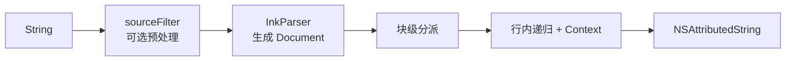
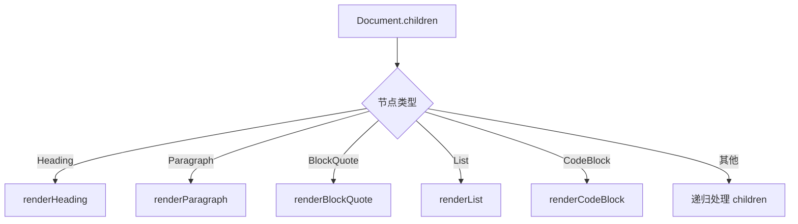
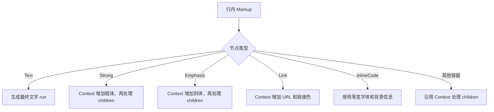
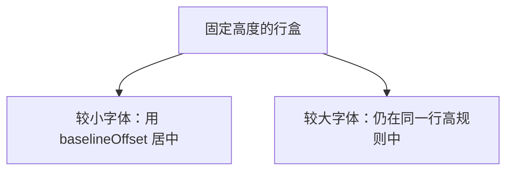
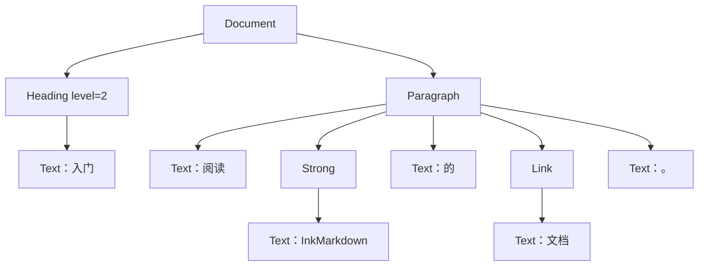

# 第 4 章：跟着一段文本走完整渲染管线

**难度**：初级到中级  
**预计时间**：75 分钟

## 本章目标

学完后，你可以：

- 说出富文本渲染从输入到输出的每一步。
- 找到 `InkConfiguration`、`InkParser`、`InkRenderer` 的职责边界。
- 解释块级分派和行内分派为什么分开。
- 解释 `InkTextContext` 如何保留嵌套样式。
- 知道修改颜色、间距、语义或扩展点分别应该去哪里。

## 前置知识

- 完成[第 2 章](02-commonmark-gfm-and-markup-tree.md)，能读简单 Markup 树。
- 完成[第 3 章](03-nsattributedstring-and-textkit.md)，知道 attribute run 是什么。

## 4.1 先看最短调用

```swift
let source = "# 欢迎\n\n你好，**UIKit**。"
let result = InkAttributedRenderer.render(source)
textView.attributedText = result
```

这一行 `render` 内部经过五个阶段：



从这里开始，请一直用同一个问题检查每层：

> 这一层拿到什么，决定什么，又返回什么？

## 4.2 阶段一：InkConfiguration 收集一次渲染所需的选择

`InkConfiguration` 不是渲染器。它是一次渲染的配置包。

| 属性 | 作用 | 初学者可以怎样理解 |
| --- | --- | --- |
| `appearance` | 字号、颜色、间距等视觉参数 | 主题配置 |
| `inlineSyntaxes` | 业务自定义行内文字规则 | 行内插件列表 |
| `sourceFilter` | 解析前修改原始字符串 | 输入清洗步骤 |
| `blockHandlers` | 把特定块换成独立 UIView | 块级路由表 |
| `linkTapHandler` | 处理链接点击 | 交互回调 |

默认配置写法：

```swift
let result = InkAttributedRenderer.render(source, configuration: .standard)
```

自定义正文颜色：

```swift
var appearance = InkAppearance()
appearance.text.color = .systemIndigo

let configuration = InkConfiguration(appearance: appearance)
let result = InkAttributedRenderer.render(source, configuration: configuration)
```

优先为单次渲染传入独立 `InkAppearance`。修改 `InkAppearance.shared` 会影响之后读取全局默认值的调用，更适合明确的全局主题场景。

对应源码：[`InkConfiguration.swift`](../../Sources/InkMarkdown/Configuration/InkConfiguration.swift) 和 [`InkAppearance.swift`](../../Sources/InkMarkdown/Configuration/InkAppearance.swift)。

## 4.3 阶段二：sourceFilter 只处理解析前的源文本

如果配置了 `sourceFilter`，`render` 会先调用它：

```swift
let filtered = configuration.sourceFilter?(source) ?? source
```

适合它的任务：

- 移除业务传输层插入的特殊占位符。
- 把后端约定的轻量写法转换为标准 Markdown。
- 在进入解析器前做统一清洗。

不适合它的任务：

- 根据 Markup 节点类型决定样式。
- 绘制表格。
- 处理链接点击。

原因很简单：`sourceFilter` 此时只看到字符串，还没有语法树，也没有 UIKit 视图。

## 4.4 阶段三：InkParser 把字符串变成 Document

```swift
let document = InkParser.parse(filtered)
```

`InkParser` 当前只是对 swift-markdown 的薄包装：

```swift
public static func parse(_ source: String) -> Document {
  Document(parsing: source)
}
```

它只负责解析，不决定颜色和 UIView。保持这一层很薄有两个好处：

- 项目不重复实现 Markdown 语法。
- 以后需要统一解析选项时，有明确入口可改。

对应源码：[`InkParser.swift`](../../Sources/InkMarkdown/Parser/InkParser.swift)。

## 4.5 阶段四：先按块级节点分派

`InkRenderer.renderDocument` 遍历 `Document.children`。每个 child 通常是标题、段落、列表等块级节点。



块级方法主要决定：

- 这一块采用什么基础字号和颜色。
- 行高、缩进、段后距等 paragraph style。
- 子节点之间怎样连接。
- 是否添加引用线、代码背景等自定义 attribute。

注意：这里讲的是 `InkAttributedRenderer` 的富文本通道。独立 UIView 的块路由由 `InkBlockRenderer` 负责，下一章会讲。

## 4.6 阶段五：行内节点递归并向下传 Context

段落或标题内部会继续调用 `renderInline`：



`InkTextContext` 可以理解为递归过程中随身携带的“当前样式背包”。它包含：

- 当前字体
- 当前文字颜色
- 当前链接 URL
- 斜体倾斜量
- 当前 appearance

### 为什么要向下传，而不是渲染后再覆盖

看这个嵌套例子：

```markdown
# 阅读 [**重要文档**](https://example.com)
```

“重要文档”同时需要：

- 标题字号和基础粗体
- `Strong` 的粗体语义
- 链接颜色
- `.link` URL
- 标题段落行高

如果父节点在子节点渲染完后粗暴覆盖整个范围，很容易把链接色或等宽字体抹掉。Context 下传让每个容器只增加或派生自己负责的部分，最终由 `Text` 叶子一次生成完整 run。


对应源码：[`InkTextContext.swift`](../../Sources/InkMarkdown/Rendering/InkTextContext.swift) 和 [`InkAttributedRenderer.swift`](../../Sources/InkMarkdown/Rendering/AttributedString/InkAttributedRenderer.swift)。

## 4.7 段落后处理只做段落真正负责的事

行内文字生成后，标题、段落等块级方法会统一设置：

- `minimumLineHeight`
- `maximumLineHeight`
- `paragraphSpacing`
- 缩进等段落参数
- 每个 run 对应的 `baselineOffset`

项目原则是：后处理不重新决定 font、color、trait 或链接。这样能保持行内样式组合的边界清楚。

固定行高可用一个盒子来理解：



数学上只涉及高度差的一半，但开发时不需要手算。统一逻辑已经集中在渲染器的段落处理函数中。

## 4.8 一次完整 walkthrough

输入：

```markdown
## 入门

阅读 **InkMarkdown** 的 [文档](https://example.com)。
```

### 第一步：解析

得到的概念树：



### 第二步：块级渲染

- `Heading` 建立标题 Context，渲染子节点，再设置标题行高和段后距。
- `Paragraph` 从正文 Context 开始，渲染子节点，再设置正文段落样式。

### 第三步：行内渲染

- 普通 `Text` 使用当前 Context。
- `Strong` 派生粗体 Context。
- `Link` 派生链接色和 URL Context。

### 第四步：拼接

标题结果、块分隔符、段落结果被追加到同一个 `NSMutableAttributedString`，最后以不可变的 `NSAttributedString` 接口返回。

## 4.9 三个 public 渲染入口怎样选

| 入口 | 输入 | 适合场景 |
| --- | --- | --- |
| `render(_:configuration:)` | Markdown `String` | 最常用的一把渲染 |
| `render(document:configuration:)` | 已解析 `Document` | 已经持有解析结果，避免重复解析 |
| `render(markups:configuration:)` | `[Markup]` | 块路由内部把未命中的节点批量送回富文本通道 |
| `renderInline(_:configuration:baseFont:textColor:)` | 仅行内 Markdown 字符串 | 表格单元格等自行控制段落布局的场景 |

`renderInline` 不设置段落属性。不要把它当成完整文档渲染入口。

## 4.10 不同修改应去哪里

| 需求 | 首选位置 |
| --- | --- |
| 改默认字号、颜色、间距 | `InkAppearance` |
| 改标准节点怎样生成富文本 | `InkAttributedRenderer` |
| 添加 `$标签$` 一类纯文本行内扩展 | `InkInlineSyntax` + `InkConfiguration.inlineSyntaxes` |
| 解析前清理业务占位符 | `sourceFilter` |
| 把整块内容变成自定义 UIView | `InkBlockHandler` |
| 改行内代码背景或引用线绘制 | `InkMarkdownLayoutManager` |
| 改 Markdown 标准解析行为 | 先评估 swift-markdown 选项或上游能力，不在渲染器手写解析器 |

## 4.11 常见误区

### 误区一：所有节点都应在一个巨大 switch 里完成

块级节点决定段落结构，行内节点组合文字样式。分开处理更容易保持职责边界。

### 误区二：未知节点应该直接崩溃

当前富文本通道会尝试递归处理未知容器的 children，以尽量保留可见文字。这是降级策略，不等于完整支持该语义。

### 误区三：样式问题都应该改 Renderer

默认数值优先放在 `InkAppearance`。Renderer 应关注节点到属性的规则，而不是散落硬编码主题值。

### 误区四：render(document:) 一定比 render(String) 快很多

只有调用方本来就持有可复用 `Document` 时，避免重复解析才有意义。不要为了“可能更快”额外维护无用的解析缓存。

## 4.12 动手练习

输入：

```markdown
> 阅读 [**重要内容**](https://example.com) 和 `sample`。
```

按顺序做：

1. 手画 `BlockQuote → Paragraph → ...` 的树。
2. 标出 Context 在 `BlockQuote`、`Link`、`Strong`、`InlineCode` 处增加了什么。
3. 用 `enumerateAttributes` 检查最终 run。
4. 验证链接文字仍有 `.link`，行内代码仍是等宽字体。

## 完成标准

你能从 `InkAttributedRenderer.render` 开始，口述到 `Text` 叶子生成 attributes，再回到段落后处理和最终拼接。并且能回答：

- `sourceFilter` 为什么看不到 Markup 节点？
- Context 下传解决了什么样式覆盖问题？
- `renderInline` 为什么不适合渲染完整文章？

下一章：[块路由与流式渲染](05-block-and-stream-rendering.md)。

