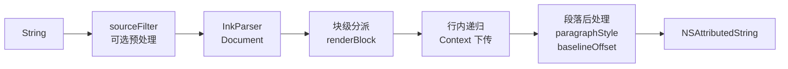
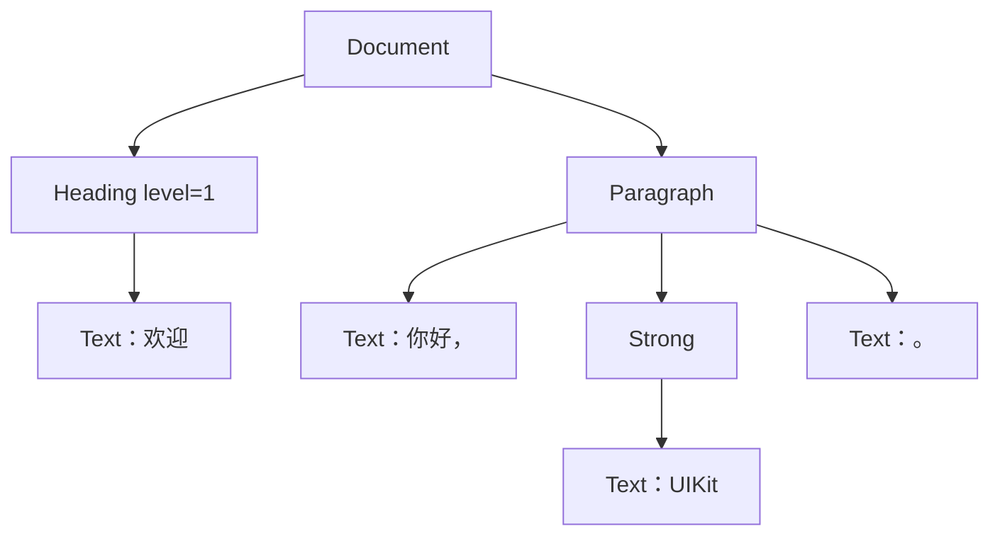
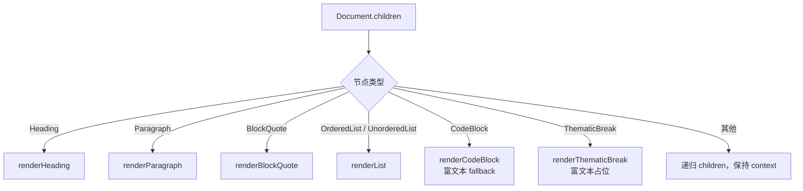
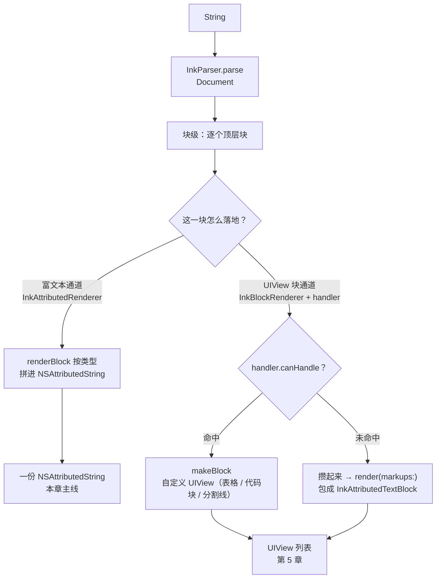
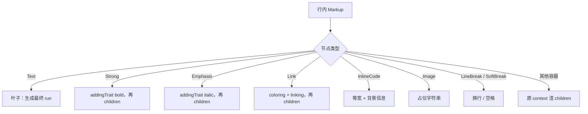
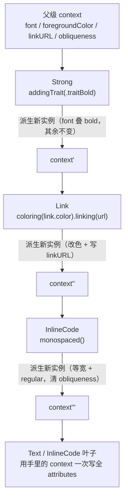
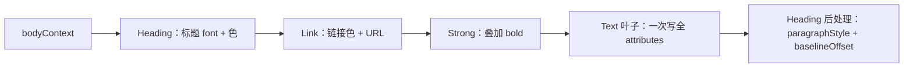
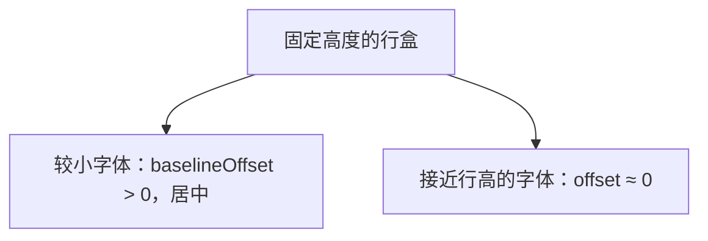
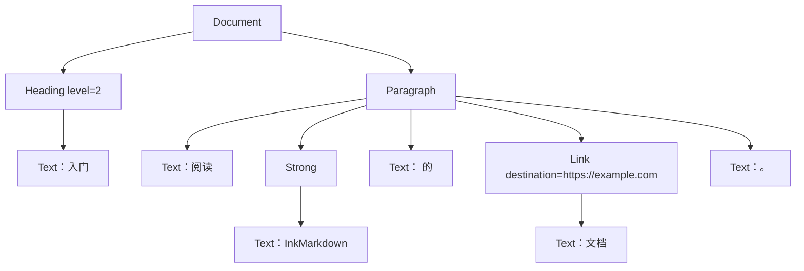
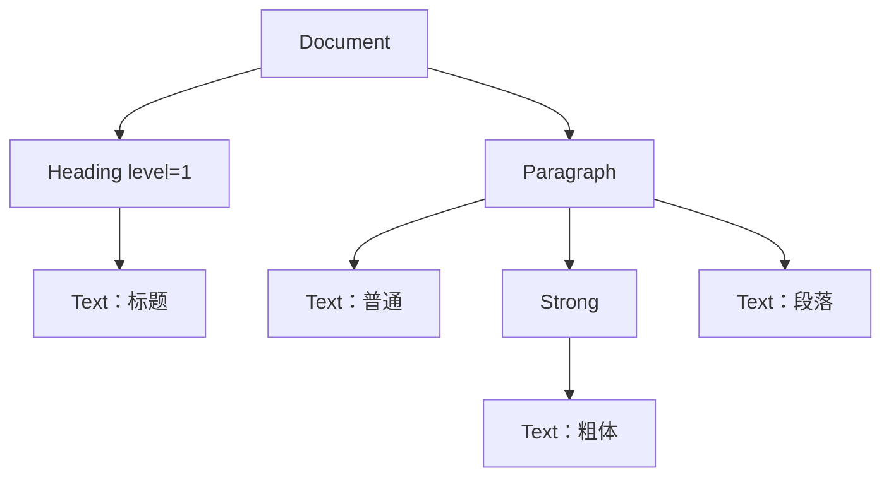

# 第 4 章：跟着一段文本走完整渲染管线

**难度**：初级到中级  
**预计时间**：100 分钟

本章只讲**富文本通道**：Markdown 字符串怎样变成 `NSAttributedString`。表格、围栏代码块如何变成独立 `UIView`，留给[第 5 章](05-block-routing.md)。流式增量留给[第 6 章](06-streaming-rendering.md)。

阅读时始终问自己同一件事：

> 这一层拿到什么，决定什么，又返回什么？

## 本章目标

学完后，你可以：

- 从 `InkAttributedRenderer.render` 口述到 `Text` 叶子生成 attributes，再回到段落后处理与拼接。
- 分清 `InkConfiguration`、`InkParser`、公开入口 `InkAttributedRenderer`、私有实现 `InkRenderer` 各自管什么。
- 解释块级分派和行内分派为什么分开。
- 说明 `InkTextContext` 如何派生，以及为什么禁止“先渲子节点再 enumerate 覆盖”。
- 改颜色、间距、语义规则或扩展点时，能判断该动哪一层。

## 前置知识

- [第 2 章](02-commonmark-gfm-and-markup-tree.md)：能读简单 Markup 树，知道块级与行内。
- [第 3 章](03-nsattributedstring-and-textkit.md)：知道 attribute run、段落样式，以及自定义 attribute 是“先描述、后绘制”。

建议边读边打开这些源码文件（路径相对仓库根）：

| 文件 | 角色 |
| --- | --- |
| `Sources/InkMarkdown/Configuration/InkConfiguration.swift` | 一次渲染的配置包 |
| `Sources/InkMarkdown/Configuration/InkAppearance.swift` | 字号、颜色、间距等默认值 |
| `Sources/InkMarkdown/Parser/InkParser.swift` | 解析入口 |
| `Sources/InkMarkdown/Rendering/AttributedString/InkAttributedRenderer.swift` | 富文本渲染主逻辑 |
| `Sources/InkMarkdown/Rendering/InkTextContext.swift` | 行内样式上下文 |
| `Sources/InkMarkdown/Rendering/InkInlineSyntax.swift` | 业务行内扩展协议 |

---

## 4.1 先看最短调用

业务侧最常见的写法只有三行：

```swift
let source = "# 欢迎\n\n你好，**UIKit**。"
let result = InkAttributedRenderer.render(source)
textView.attributedText = result
```

`render` 默认使用 `InkConfiguration.standard`（读 `InkAppearance.shared`，无行内扩展，无 sourceFilter）。你也可以显式传入配置：

```swift
let result = InkAttributedRenderer.render(source, configuration: .standard)
```

### 公开类型与私有实现

| 名字 | 可见性 | 职责 |
| --- | --- | --- |
| `InkAttributedRenderer` | public | 四个入口方法：接字符串 / Document / Markup 数组 / 纯行内 |
| `InkRenderer` | private，同文件 | 真正的块级 / 行内递归；业务代码不会直接调用它 |
| `InkParser` | public | `Document(parsing:)` 的薄包装 |
| `InkConfiguration` | public | 一次渲染的配置包，不是渲染器 |
| `InkTextContext` | internal | 行内递归时携带的样式背包 |

对外只认 `InkAttributedRenderer`。读源码时会在同文件底部看到 `private struct InkRenderer`，那是实现细节。

### 五个阶段



对应源码（逻辑顺序，不是完整拷贝）：

```swift
// InkAttributedRenderer.render(_:configuration:)
let filtered = configuration.sourceFilter?(source) ?? source
let document = InkParser.parse(filtered)
let renderer = InkRenderer(configuration: configuration)
return renderer.renderDocument(document)
```

| 阶段 | 输入 | 决定什么 | 输出 |
| --- | --- | --- | --- |
| sourceFilter | 原始 `String` | 是否改写源文本 | 仍是 `String` |
| InkParser | 过滤后字符串 | 语法结构（不碰样式） | `Document` |
| 块级分派 | 顶层 / 嵌套块节点 | 基础字体色、段落度量、块间连接 | 一块 `NSAttributedString` |
| 行内递归 | 行内节点 + `InkTextContext` | 每个字符 run 的 font / color / link 等 | 行内片段 |
| 段落后处理 | 已拼好的行内结果 | 行高、段后距、baselineOffset | 带段落属性的块 |

---

## 4.2 阶段一：`InkConfiguration` 收集一次渲染的选择

`InkConfiguration` **不是**渲染器。它只打包“这次渲染要不要自定义外观、扩展、过滤、块路由、链接回调”。

```swift
public struct InkConfiguration {
  public var appearance: InkAppearance
  public var inlineSyntaxes: [InkInlineSyntax]
  public var sourceFilter: ((String) -> String)?
  public var blockHandlers: [InkBlockHandler]
  public var linkTapHandler: ((URL, UIView) -> Bool)?
}
```

### 每个字段在管线里出现的时机

| 属性 | 何时被读 | 初学者可以怎样理解 |
| --- | --- | --- |
| `appearance` | 几乎全程：建 bodyContext、标题/引用/列表/代码/链接 | 主题与度量字典 |
| `sourceFilter` | 解析**之前** | 源文本清洗 |
| `inlineSyntaxes` | 渲染到 `Text` 叶子时，按数组顺序询问 | 行内插件列表 |
| `blockHandlers` | **`InkBlockRenderer` 才用**；纯 `InkAttributedRenderer.render` 不走它 | 整块换成 UIView 的路由表 |
| `linkTapHandler` | 显示层（例如表格单元格、带自定义 TextView 的块）处理点击时 | 链接点击回调 |

注意：`blockHandlers` 和 `linkTapHandler` 主要服务块路由 / 视图装配通道。本章跟读的是 `InkAttributedRenderer`，你会在代码里看到 `appearance`、`sourceFilter`、`inlineSyntaxes`；`blockHandlers` 要到第 5 章才进入主路径。

### 默认配置与自定义外观

```swift
// 等价于 configuration: .standard
let result = InkAttributedRenderer.render(source)

// 只改本次正文颜色
var appearance = InkAppearance()
appearance.text.color = .systemIndigo
let configuration = InkConfiguration(appearance: appearance)
let result = InkAttributedRenderer.render(source, configuration: configuration)
```

`InkAppearance` 按语法元素分子配置：`text`、`heading`、`blockquote`、`list`、`codeBlock`、`inlineCode`、`table`、`thematicBreak`、`link`。默认值写在 `InkAppearance.swift` 里，例如正文 `fontSize = 17`、`lineHeight = 28`、`paragraphSpacing = 12`。

两种用法：

1. **单次实例**：上面的写法。只影响这一次 `render`。
2. **全局 `InkAppearance.shared`**：App 启动时改一次，之后所有读 shared 的调用都跟新值。适合明确的全局主题；不适合“只想改某一个页面”的临时实验。

```swift
// 全局主题：之后 render 默认都会读到
InkAppearance.shared.text.color = .label
InkAppearance.shared.heading.h1FontSize = 22
```

`InkConfiguration()` 初始化时 `appearance` 默认是 `.shared`（值拷贝当前 shared 的内容）。改 shared 再新建 configuration，会拿到新值；已经创建好的 configuration 里的 appearance 不会自动跟着变。

### 和 `InkAppearance` 的分工

| 放哪里 | 适合什么 |
| --- | --- |
| `InkAppearance` | 字号、颜色、行高、段间距、圆角、竖线宽度等**视觉数字与颜色** |
| `InkAttributedRenderer`（`InkRenderer`） | 节点类型 → 如何组 attributes 的**规则** |
| `InkConfiguration` 的扩展字段 | 业务插件与单次渲染开关 |

原则：默认主题数字尽量不写死在 Renderer 分支里；Renderer 只读 `appearance` 再决定挂什么 attribute。

---

## 4.3 阶段二：`sourceFilter` 只处理解析前的字符串

若配置了 `sourceFilter`，入口会先调用：

```swift
let filtered = configuration.sourceFilter?(source) ?? source
```

此时**还没有** Markup 树，也**没有** UIKit 视图。函数签名是 `(String) -> String`，能力边界就是字符串变换。

### 适合做的事

- 去掉传输层占位符，例如业务协议插入的 `<ref id="..." />`。
- 把后端约定的轻量写法转成标准 Markdown（例如把 `[[page]]` 转成 `[page](...)`）。
- 统一换行、去掉 BOM、裁剪首尾空白（若产品需要）。

```swift
let config = InkConfiguration(
  sourceFilter: { source in
    source.replacingOccurrences(of: "<ref />", with: "")
  }
)
let result = InkAttributedRenderer.render(raw, configuration: config)
```

### 不适合做的事

| 想做的事 | 为什么不该放 sourceFilter | 应去哪里 |
| --- | --- | --- |
| 标题用更大字号 | 还不知道哪些字符是 Heading | `InkAppearance.heading` |
| 表格画网格 | 没有 Table 节点，也没有 UIView | `InkBlockHandler`（第 5 章） |
| 链接点击跳转 | 没有视图，也没有 URL 点击事件 | `linkTapHandler` / 宿主 TextView |
| 识别 `$标签$` | 可以在字符串层硬扫，但会和标准解析抢活；项目设计是解析后再扫 `Text` | `InkInlineSyntax` |

一句话：sourceFilter 改的是**进解析器之前的字符**，不改**树怎么渲**。

---

## 4.4 阶段三：`InkParser` 把字符串变成 `Document`

```swift
public enum InkParser {
  public static func parse(_ source: String) -> Document {
    Document(parsing: source)
  }
}
```

整层目前就是这一行包装。它只负责解析，不决定颜色、不创建 View。

保持很薄有两个直接好处：

1. 项目不自己实现 CommonMark / GFM 规则。
2. 以后若要统一解析选项（例如扩展开关），只改这一处入口。

对输入：

```markdown
# 欢迎

你好，**UIKit**。
```

概念上得到：



自己在调试时可以：

```swift
let document = InkParser.parse(source)
print(document.debugDescription())
```

`Document` 的 `children` 通常是块级节点。渲染器下一阶段遍历的就是这份列表。

解析与渲染的边界：

| 层 | 回答的问题 |
| --- | --- |
| swift-markdown / InkParser | 这些字符是什么结构？ |
| InkMarkdown 渲染 | 这个结构在 UIKit 里显示成什么样？ |

---

## 4.5 阶段四：先按块级节点分派

`renderDocument` 的逻辑可以读成：

```swift
func renderDocument(_ document: Document) -> NSAttributedString {
  let result = NSMutableAttributedString()
  let blocks = Array(document.children)
  for (index, block) in blocks.enumerated() {
    result.append(renderBlock(block, context: bodyContext))
    if index < blocks.count - 1 {
      result.append(NSAttributedString(string: "\n"))  // 块分隔符
    }
  }
  return result
}
```

要点：

1. 每个顶层块从 **`bodyContext`** 起步（正文字号系统字体 + 正文色 + 当前 appearance）。
2. 块与块之间用单个 `"\n"` 连接（`InkRenderConstants.blockSeparator`）。
3. `renderBlock` 用 `switch` 按类型分派；功能上类似 Visitor，但没有形式化成 `MarkupVisitor`。



### 块级方法主要决定什么

- 这一块的基础字号和颜色（标题、引用会**新建或派生** Context）。
- 行高、缩进、段后距等 `NSParagraphStyle`。
- 子节点之间怎样拼接（列表 marker、引用内多段落）。
- 是否挂自定义 attribute（例如整块引用的 `.inkBlockquoteBar`）。

块级方法**不**在事后把子树的 font/color 统一改写一遍。行内样式由 Context 下传在叶子完成。

### 几种常见块在做什么（读源码时的导览）

**Heading**

- 按 `level` 从 `appearance.heading` 取字号、行高、段后距。
- 新建 headingContext：`systemFont(size, weight: .bold)` + 标题色。
- 渲染行内 children，再 `applyFixedLineHeight`。

注意：H1 用 `h1FontSize` / `h1LineHeight` / `h1SpacingAfter`；H2–H5 共用另一组默认值，不是每级一个独立字号表。

**Paragraph**

- 直接用传入的 context（顶层就是 bodyContext；若在引用/列表嵌套里，则是外层派生后的 context）。
- 渲完行内后施加正文 `lineHeight` 与 `paragraphSpacing`。

**BlockQuote**

- 派生 quoteContext：引用字号 + 引用色。
- 段落子节点：引用行高 + 左缩进（竖线宽度 + leftPadding）。
- 非段落子节点（嵌套列表、代码块等）：先 `renderBlock`，再**只叠加**缩进，不全 range 用引用规格盖掉已有段落样式。
- 整段结果挂上 `.inkBlockquoteBar`（竖线由 `InkMarkdownLayoutManager` 画，见第 3 章）。

**List**

- 先算 marker 最大宽度（有序用最大序号，无序用 `•`），做悬挂缩进。
- 每项：`marker` + 第一段行内文字；嵌套列表再递归 `renderBlock`。
- 任务列表 checkbox 时 marker 用 `☑` / `☐`。

**CodeBlock / ThematicBreak（本通道）**

- 在**纯富文本**入口里仍有实现，但是 fallback / 占位：等宽 + 背景色字符串、分割线用删除线 + 零宽字符等。
- 真正的代码块容器、分割线 View，默认走 `InkBlockRenderer` + handler。ExampleApp 与块路由场景不要只盯着这里。

**default 分支**

- 未知块类型：拼接 children 的 `renderBlock` 结果，context 原样下传。
- 目的是尽量保留可见文字，不是宣称完整支持该语义。

### 和块路由通道的关系

| 调用 | 代码块 / 表格 / 分割线 |
| --- | --- |
| `InkAttributedRenderer.render(...)` | 走富文本 fallback（表格甚至可能只剩文字或空） |
| `InkBlockRenderer.render(...)` | handler 命中 → 独立 `UIView` 块；未命中 → 攒起来再 `render(markups:)` |

把两条通道画在一起，就能看清本章处在哪一侧。解析出 `Document` 后，块级这一步有两个去向——**富文本通道**把块拼进一份 `NSAttributedString`（本章主线），**UIView 块通道**由 `InkBlockRenderer` 按 `blockHandlers` 逐块判定：命中的整块交给 handler 变成自定义 `UIView`，没命中的攒成一批再走富文本通道包成 `InkAttributedTextBlock`。



本章把注意力放在左侧的富文本通道。右侧 UIView 块通道见第 5 章。

---

> ### ✅ 阶段小结（1/3）· 可以在这里休息
>
> 到这里，你应该能口述**前半条管线**：`render` 从 `String` 出发，经可选 `sourceFilter`（解析前）、`InkParser.parse` 得到 `Document`，再由 `renderBlock` 按节点类型分派到各块级方法。你也能分清「解析前改字符」和「解析后按结构渲染」是两件事。
>
> 下一段（4.6–4.7）进入本章最烧脑的部分：行内递归与 `InkTextContext` 下传。建议先合上文档，对着源码把 4.1–4.5 复述一遍。**可以在这里休息，明天继续。**

---

## 4.6 阶段五：行内递归与 `InkTextContext`

段落、标题等块在内部调用 `renderInlineChildren` → `renderInline`。



### Context 里有什么

`InkTextContext` 是 internal 值类型，可以想成递归时随身带的样式背包：

| 字段 | 含义 |
| --- | --- |
| `font` | 当前基准字体（字号、字重、family、traits） |
| `foregroundColor` | 当前前景色 |
| `linkURL` | 非 nil 表示处于某个链接内，叶子应挂 `.link` |
| `obliqueness` | 字体没有 italic 变体时的人工倾斜量 |
| `appearance` | 完整样式配置，叶子可再读 inlineCode / link 等 |

派生方法都返回**新实例**，不改自身：

| 方法 | 语义 |
| --- | --- |
| `addingTrait(.traitBold / .traitItalic)` | **叠加** trait，保留字号与 family |
| `monospaced()` | **重置**为等宽 + regular，只保留 pointSize，并清 obliqueness |
| `coloring(_:)` | 换前景色 |
| `linking(_:)` | 写入 linkURL |
| `withFont(_:)` | 整份替换基准字体 |

`addingTrait` 与 `monospaced()` 方向相反：前者叠加，后者重置。因此 `**加粗里的 `code`**` 最终仍是 regular 等宽——inline code 会丢掉继承来的 bold。

### Context 是**向下传**的，不是事后回写

把递归摊开看：每一层容器拿到父级的 `InkTextContext`，只**派生**出自己负责的那一份（`Strong` 叠 bold、`Link` 改色并写 URL……），把新实例交给子节点；到叶子时 context 已经攒齐了一路的决定，一次写进 run。整条链路信息只往下走，父节点渲完子节点后**不回头** enumerate 覆盖已经写好的属性。



对照“先渲染、再 enumerate 覆盖”的旧做法（❌）：那种写法父节点要在子树渲完后按 range 回改 font/color，极易与 inline code 的等宽、链接色、引用色互相踩。context 下传把这一整类 bug 从根上消除——正是 `InkTextContext` 文件头注释强调的设计要义。

### 叶子节点一次性写 attributes

真正“出货”的是叶子：

**`Text`**

1. 若 `configuration.inlineSyntaxes` 非空，按顺序问每个扩展；有人返回非 nil 就直接用。
2. 否则用 context 的 font、foregroundColor；若有 linkURL 挂 `.link`；若 obliqueness ≠ 0 挂 `.obliqueness`。

**`InlineCode`**

- 字体：`context.monospaced().font`（环境字号 + 等宽 + regular）。
- 颜色：`appearance.inlineCode.textColor ?? context.foregroundColor`（默认跟随环境色）。
- 背景：系统 `.backgroundColor` + 自定义 `.inkInlineCodeBackground`。
- 左右各插一个零宽字符，用 `kern` 做出外边距。
- 若 context 带 linkURL，代码文字也挂 `.link`（支持 `` [`code`](url) ``）。

**`Image`**

- 当前富文本通道输出占位串，例如 `[🖼 alt或source]`，用次要文字色；不下载图片。

**`SoftBreak` / `LineBreak`**

- 软换行 → 空格；硬换行 → `"\n"`。

### 为什么要向下传，而不是渲完再覆盖

看嵌套：

```markdown
# 阅读 [**重要文档**](https://example.com)
```

“重要文档”同时需要：

- 标题字号与标题基础粗体
- `Strong` 的 bold trait（在标题 bold 上再叠加，通常仍是 bold）
- 链接颜色
- `.link` URL
- 标题的段落行高与段后距（块级后处理）

错误做法示意：

```text
1. 先把子树渲成默认正文样式
2. 父节点 enumerate 整段改成标题字体
3. 再 enumerate 链接范围改成蓝色
```

问题：步骤 2 容易把行内代码的等宽抹成标题字体；步骤 3 和引用色、代码色互相踩。项目早期若走“事后回写”，就会出现这类 bug。

正确做法：



每个容器只派生自己负责的部分；叶子写最终 run；块级后处理**只**动段落度量与 baselineOffset，不再改 font/color/link。

### 用属性结果对照（概念表）

对 `"重要文档"` 这个 Text 叶子，预期大致是：

| attribute | 来源 |
| --- | --- |
| `.font` | Heading 的 bold 标题字号，经 Strong 保持 bold |
| `.foregroundColor` | Link 的 `appearance.link.color` |
| `.link` | Link 的 destination 解析成的 `URL` |
| `.paragraphStyle` | Heading 后处理：标题行高 + spacingAfter |
| `.baselineOffset` | 后处理按该 run 的 font 与固定行高计算 |

你可以用下面方式自查（范围用真实 UTF-16 注意点见第 3 章）：

```swift
let rendered = InkAttributedRenderer.render("# 阅读 [**重要文档**](https://example.com)")
rendered.enumerateAttributes(
  in: NSRange(location: 0, length: rendered.length),
  options: []
) { attrs, range, _ in
  let slice = (rendered.string as NSString).substring(with: range)
  print(range, slice, attrs[.font] as Any, attrs[.link] as Any)
}
```

---

## 4.7 段落后处理：只做段落真正负责的事

行内拼完后，标题、段落、列表行等会调用 `applyFixedLineHeight`。文件头注释写得很清楚：后处理**仅**两件事：

1. 整段挂统一的 `.paragraphStyle`（固定行高、段前段后距，可选缩进）。
2. 按每个 run 自己的 `.font` 派生 `.baselineOffset`。

**不**在这里改 font、color、trait、link、自定义背景。

### 固定行高

```swift
para.minimumLineHeight = lineHeight
para.maximumLineHeight = lineHeight
para.lineSpacing = 0
```

min = max，行盒高度锁死。混排标题字号与句中代码字号时，行高仍由块级规则决定，不会被某一段大字“撑乱”。

### baselineOffset

```swift
baselineOffset = max(0, (fixedLineHeight - font.lineHeight) / 2)
```

可以想成：行盒高度固定；字形天然高度更矮时，用偏移把文字在盒子里大致垂直居中。delta ≤ 0 时偏移为 0，避免负值把文字顶出盒子。



开发时不必手算每个字号；统一逻辑在 `applyFixedLineHeight` / `baselineOffset(for:in:)`。相关约束见贡献者文档 [核心原理 · 固定行高](../contributor-guide/03-principles.md)。

### 引用与列表的例外细节

- **引用内的普通段落**：`applyFixedLineHeight` + 设置 `firstLineHeadIndent` / `headIndent`。
- **引用内的嵌套块**：不再用同一套引用行高盖全 range，只把已有 `paragraphStyle` 的缩进加上引用缩进。
- **列表首行**：marker 与正文同一行；`headIndent = maxMarkerWidth`，悬挂缩进让换行后正文对齐。

这些细节不必一次记死，知道“块级负责段落几何，行内负责 run 样式”即可；改 bug 时再对照对应函数。

---

> ### ✅ 阶段小结（2/3）· 可以在这里休息
>
> 现在你握住了本章的**核心心智模型**：行内节点靠 `InkTextContext` 逐层**派生下传**，叶子一次写全 attributes；段落后处理（`applyFixedLineHeight`）**只**管 `.paragraphStyle` 与逐 run 的 `.baselineOffset`，绝不回改 font/color/link。这套“下传 + 叶子出货 + 后处理只碰段落几何”的分工，是理解整个渲染器的钥匙。
>
> 下一段 4.8 会把 4.1–4.7 串成一次完整走查，带真实中间值。**可以在这里休息，明天带着这个模型继续。**

---

## 4.8 一次完整 walkthrough

输入：

```markdown
## 入门

阅读 **InkMarkdown** 的 [文档](https://example.com)。
```

### 第 0 步：配置

`render(source)` → `configuration = .standard`，无 sourceFilter，appearance 来自 shared 当前值。

### 第 1 步：解析

```swift
let document = InkParser.parse(source)
```

概念树：



### 第 2 步：Document 遍历

1. `renderBlock(Heading)`，context = bodyContext。
2. 追加 `"\n"`。
3. `renderBlock(Paragraph)`，context = bodyContext。

### 第 3 步：Heading 块

1. level = 2 → 用 `heading.fontSize`、`lineHeight`、`spacingAfter`（非 H1）。
2. headingContext = bold 系统字体 + 标题色。
3. 渲 `Text "入门"` → run：标题 font、标题色。
4. `applyFixedLineHeight`：标题行高 + 段后距 + baselineOffset。

### 第 4 步：Paragraph 块

从 bodyContext 渲五个行内节点：

| 节点 | Context 变化 | 叶子 attributes（概念） |
| --- | --- | --- |
| Text「阅读 」 | 无 | 正文字体、正文色 |
| Strong → Text「InkMarkdown」 | + bold | 粗体正文字体、正文色 |
| Text「 的 」 | 无 | 正文字体、正文色 |
| Link → Text「文档」 | 链接色 + URL | 链接色、`.link` |
| Text「。」 | 无 | 正文字体、正文色 |

然后段落统一：`text.lineHeight`、`text.paragraphSpacing`，再按 run 写 baselineOffset。

### 第 5 步：拼接与返回

`NSMutableAttributedString` 在 Document 层追加两块与中间的 `"\n"`，最后以 `NSAttributedString` 接口返回。调用方赋给 `UITextView.attributedText`（或包进 `InkAttributedTextBlock` 以启用自定义绘制）。

若只赋给任意 `UITextView`：标准 font/color/link/paragraph 都在；圆角句中代码背景、引用竖线需要第 3 章说的 `InkMarkdownLayoutManager` 链。

### 带真实中间值的最小走查

上面的 walkthrough 讲的是“概念”。这里换一个更小的输入，把**真实的中间值**摊开——数值取自 `InkAppearance` 默认值（`text.fontSize = 17`、`text.lineHeight = 28`、`text.paragraphSpacing = 12`、`text.color = .label`；标题 `h1FontSize = 19`、`h1LineHeight = 30`、`h1SpacingAfter = 16`、`heading.color = .label`）。

输入：

```swift
let s = "# 标题\n\n普通**粗体**段落"
let result = InkAttributedRenderer.render(s)
```

**① Markup 树的形状**



**② 到达 Strong→「粗体」叶子那一刻的 `InkTextContext`**

`bodyContext`（`systemFont(17)` + `.label`）先原样传给 `Paragraph`，再由 `Strong` 调 `addingTrait(.traitBold)` 派生一份新实例：

| 字段 | 派生前（bodyContext） | 派生后（Strong 内，给「粗体」叶子） |
| --- | --- | --- |
| `font` | `systemFont(ofSize: 17)` | `systemFont(ofSize: 17, weight: .bold)`（只叠了 bold trait） |
| `foregroundColor` | `.label` | `.label`（**未变**） |
| `linkURL` | `nil` | `nil`（**未变**） |
| `obliqueness` | `0` | `0`（**未变**） |

关键点：`Strong` 只碰了 `font`，颜色、链接、倾斜都原样下传。这正是“每个容器只派生自己负责的那份”。

**③ 最终 `NSAttributedString` 的属性 run**（最终串 = `"标题\n普通粗体段落"`，长度 9 个 UTF-16 单元）

| range | 文字 | `.font` | `.foregroundColor` | `.paragraphStyle` | `.baselineOffset` |
| --- | --- | --- | --- | --- | --- |
| `{0,2}` | 标题 | `systemFont(19, .bold)` | `.label` | `min=max=30`, `paragraphSpacing=16` | `max(0,(30−font.lineHeight)/2)` |
| `{2,1}` | `\n` | —（块分隔符，无 attribute） | — | — | — |
| `{3,2}` | 普通 | `systemFont(17)` | `.label` | `min=max=28`, `paragraphSpacing=12` | `max(0,(28−font.lineHeight)/2)` |
| `{5,2}` | 粗体 | `systemFont(17, .bold)` | `.label` | 同上（同一段落样式） | 同上 |
| `{7,2}` | 段落 | `systemFont(17)` | `.label` | 同上 | 同上 |

要点：三个正文 run 共用**同一份**段落样式（行高锁死 28），只有 `.font` 在「粗体」处切成 bold；`.baselineOffset` 是各 run 按自身 `font` 派生的纯函数（见 4.7），字形偏矮时 > 0，把文字在固定行盒里垂直居中。这里没有 `.link` / `.inkInlineCodeBackground`，因为输入不含链接与行内代码。

**④ 这份结果最后被谁持有**

`render` 返回的就是上面这份 `NSAttributedString`。落地有两种：

- 直接 `textView.attributedText = result`：font / color / paragraphStyle / baselineOffset 都生效。
- 包进 `InkAttributedTextBlock`：其 `makeView()` 会建 `NSTextStorage` + `InkMarkdownLayoutManager` + `InkAttributedBlockTextView`（`UITextView` 子类），从而额外支持链接点击回调与第 3 章的自定义绘制（本例没有句中代码背景 / 引用竖线，所以看不出差别）。

---

> ### ✅ 阶段小结（3/3）· 建议今日到此为止
>
> 恭喜——到这里你已经把**一整条富文本管线**从头走到尾，还带真实中间值验证过一遍。回到本章目标那几条，现在应该都能自己讲出来了。这是本章的**天然完成点**。
>
> 后面的 4.9、4.10 是**贡献者级的 API 细节**（怎么在四个入口里选、怎么写行内扩展），零基础第一遍**可以直接跳到 4.11 或先收工**。**强烈建议今日到此为止，把前面的模型消化好再回来。**

---

## 4.9（进阶，首次学习可跳过）四个 public 入口怎样选

> **这是进阶内容。** 第一次跟学习路径走的读者可以跳过 4.9–4.10，等走完整条路径、真要做二次开发时再回来。完整的公开 API 说明见 [贡献者指南 · 开发](../contributor-guide/04-development.md)。

```swift
// 1. 字符串一把梭（最常用）
InkAttributedRenderer.render(_ source:configuration:)

// 2. 已有 Document，避免重复解析
InkAttributedRenderer.render(document:configuration:)

// 3. 多个顶层 Markup（块路由 flush 未命中节点时）
InkAttributedRenderer.render(markups:configuration:)

// 4. 只渲行内，不设段落属性
InkAttributedRenderer.renderInline(_:configuration:baseFont:textColor:)
```

| 入口 | 输入 | 适合场景 | 注意 |
| --- | --- | --- | --- |
| `render(_:)` | Markdown `String` | 列表、详情、静态页的完整富文本 | 内部会 parse |
| `render(document:)` | `Document` | 调用方已解析且会复用树 | 不会再走 sourceFilter |
| `render(markups:)` | `[Markup]` | `InkBlockRenderer` 把相邻普通块一次渲成富文本 | 块间 `\n`；非空时末尾还有 `0.1pt` 哨兵段落，用来兑现块下间距 |
| `renderInline` | 行内向字符串 + 调用方给的 baseFont/textColor | 表格单元格等**自己控制**行高与对齐的场景 | **不**设置 paragraphStyle；不要当整篇文档入口 |

### `renderInline` 细节

实现会 `parse` 整段字符串，再找**第一个** `Paragraph`，只渲它的行内 children。若找不到段落，退回整串纯文本 + 你传入的 font/color。

因此：

- 传入 `"**a** 和 *b*"` 这类行内片段：通常得到一个 Paragraph，行为符合预期。
- 传入带多个块的长文：只会处理第一个段落形态的内容，其余丢掉；段落度量也不会按正文规则上。
- 表格单元格走这条路径，是因为单元格布局由表格 View 负责，不需要正文的 `paragraphSpacing`。

### `render(document:)` 与性能

只有**本来就持有可复用 Document** 时，跳过解析才有意义。不要为了“可能更快”单独维护一套很少命中的解析缓存。`render(String)` 对多数界面足够。

### `render(markups:)` 的尾部哨兵

非空 markups 渲染结束后，会追加一段极矮的 `"\n\u{200B}"` 段落（约 0.1pt 行高）。作用是让前一块通过 `paragraphSpacing` 设下的“距下文间距”在 TextKit 里有下一段可参照，从而在块路由拼装时间距表现稳定。这是实现细节；排查“最后一块底部间距不对”时值得知道。

---

## 4.10（进阶，首次学习可跳过）行内扩展：`InkInlineSyntax` 插在哪里

> **这是进阶内容。** 和 4.9 一样，只有当你要给业务写自定义行内语法（`$标签$`、`@提及` 等）时才需要。第一遍学习可跳过，扩展点的完整约定见 [贡献者指南 · 开发](../contributor-guide/04-development.md)。

标准 Markdown 行内（强调、链接、行内代码等）由 `renderInline` 的 switch 处理。业务自定义写法（`$标签$`、`@提及`）不应改核心 switch，而应：

1. 实现 `InkInlineSyntax`。
2. 放进 `InkConfiguration.inlineSyntaxes`。

触发点在 **`renderText`**：已经确认是 `Text` 叶子之后、写默认 attributes 之前。

```swift
// 伪序
if !configuration.inlineSyntaxes.isEmpty {
  let inlineContext = InkInlineContext(
    baseFont: context.font,
    textColor: context.foregroundColor,
    appearance: appearance
  )
  for syntax in configuration.inlineSyntaxes {
    if let rendered = syntax.render(text: textNode.string, context: inlineContext) {
      return rendered  // 第一个接手的扩展赢
    }
  }
}
// 否则默认 Text attributes
```

扩展应基于 `InkInlineContext` 的 baseFont / textColor 画，这样标题里的 `$标签$` 与正文里的字号一致。返回 `nil` 表示“这段不归我”，交给下一个扩展或默认渲染。

与块级扩展对比：

| | 行内 `InkInlineSyntax` | 块级 `InkBlockHandler` |
| --- | --- | --- |
| 粒度 | `Text` 字符串片段 | 整块 Markup → UIView |
| 通道 | 富文本 | 块路由 |
| 顺序 | 数组顺序，先返回非 nil 者 | 先 `canHandle`，再 `makeBlock` |

---

## 4.11 不同修改应去哪里

| 需求 | 首选位置 | 不要先改 |
| --- | --- | --- |
| 默认字号、颜色、行高、段间距 | `InkAppearance` | Renderer 里硬编码数字 |
| 某次渲染单独主题 | `InkConfiguration(appearance:)` | 临时改 shared 又忘改回 |
| 标准节点如何变成 attributes | `InkAttributedRenderer` 内对应 `render*` | sourceFilter |
| `$标签$` 一类纯文本行内业务语法 | `InkInlineSyntax` + `inlineSyntaxes` | 手写第二套 Markdown 解析器 |
| 解析前清占位符 | `sourceFilter` | 渲染后再扫整棵树 |
| 整块变成自定义 UIView | `InkBlockHandler`（第 5 章） | 硬塞进 `NSAttributedString` attachment（除非有充分理由） |
| 句中代码圆角背景 / 引用竖线怎么画 | `InkMarkdownLayoutManager`（第 3 章） | 在 Renderer 里直接 `CGContext` 画 |
| CommonMark 边界解析行为 | 评估 swift-markdown 选项 / 上游 | 在 Renderer 里用字符串正则“修”树 |

---

## 4.12 常见误区

### 误区一：所有节点塞进一个巨大 switch

块级决定段落结构与块度量；行内组合文字 run。分成 `renderBlock` / `renderInline` 两套分派，边界更清晰。嵌套时块可以再调行内（段落），行内不会去“渲染一个 Heading”。

### 误区二：未知节点应该直接崩溃

当前富文本通道对未知块 / 未知行内容器会尝试递归 children，尽量保留可见文字。这是降级，不等于完整语义支持。例如删除线 `Strikethrough`：若无专门分支，会走 default 渲子节点，**不一定**带上删除线 attribute——以当前源码与[渲染语义规范](../spec/README.md)为准，不要靠猜。

### 误区三：样式问题一律改 Renderer

默认数值优先 `InkAppearance`。Renderer 负责“Heading 要读 heading 配置并 bold”，不负责“H2 到底是 17 还是 18”的产品拍板数字散落各处。

### 误区四：`render(document:)` 一定快很多

解析通常不是唯一成本；布局与绘制往往更重。只有已持有 Document 且会复用时，避免重复 parse 才划算。

### 误区五：Context 和 Configuration 是一回事

| | 生命周期 | 内容 |
| --- | --- | --- |
| `InkConfiguration` | 一次 `render` 调用 | appearance、插件、filter、handlers |
| `InkTextContext` | 一次递归路径上的当前节点 | 当前 font/color/link，随嵌套变化 |

Configuration 几乎不变地传进 `InkRenderer`；Context 在树上下下派生出很多份。

### 误区六：富文本通道里的 CodeBlock 就是 App 里看到的代码块

ExampleApp 默认块路由会把围栏代码交给 `InkCodeBlock` View。`InkAttributedRenderer` 里的 `renderCodeBlock` 是同通道 fallback。排查 UI 时先确认走的是哪个入口。

---

## 4.13 动手练习

### 练习 A：嵌套样式

输入：

```markdown
> 阅读 [**重要内容**](https://example.com) 和 `sample`。
```

按顺序做：

1. 手画树：`Document → BlockQuote → Paragraph → …`（标出 Link / Strong / InlineCode / Text）。
2. 从 bodyContext 起，写出在 BlockQuote、Link、Strong、InlineCode 处 Context 增加或重置了什么。
3. `InkAttributedRenderer.render` 后 `enumerateAttributes`，核对：
   - 「重要内容」：链接色、`.link`、粗体（在引用字号环境中）。
   - `sample`：等宽、代码背景相关 attribute；颜色默认跟随引用色（若未配置 `inlineCode.textColor`）。
4. 若用 `InkAttributedTextBlock.makeView()` 显示，再确认引用竖线与圆角代码背景是否出现；若只用裸 `UITextView`，预期自定义绘制可能缺失。

### 练习 B：改配置而不是改 Renderer

1. 只改 `appearance.link.color`，确认链接变色、正文不变。
2. 只改 `appearance.blockquote.fontSize`，确认引用内文字变，标题不受影响。
3. 加一个总是 `return nil` 的 `InkInlineSyntax`，确认结果与无扩展一致；再改成匹配某固定词并返回红色片段，确认只有 `Text` 命中时生效。

### 练习 C：入口选择

同一段含表格的 Markdown：

1. 只用 `InkAttributedRenderer.render`，观察表格是否可接受。
2. 再用 `InkBlockRenderer.render`（第 5 章），对比 block 列表。
3. 用一句话写下两个入口的职责差。

---

## 完成标准

你能不看本文、只靠源码文件名，口述下面链路：

```text
source
  → sourceFilter?
  → InkParser.parse
  → InkRenderer.renderDocument
  → renderBlock（按类型）
  → renderInline + InkTextContext 派生
  → Text / InlineCode 等叶子写 attributes
  → applyFixedLineHeight
  → 块间 "\n" 拼接
  → NSAttributedString
```

并能回答：

1. `sourceFilter` 为什么看不到 Markup 节点？  
2. Context 下传解决了哪类“样式互相覆盖”问题？举一个标题 + 链接 + 粗体的例子。  
3. `renderInline` 为什么不适合渲染完整文章？  
4. 改链接颜色应该动 `InkAppearance` 还是 `sourceFilter`？  
5. 私有 `InkRenderer` 和公开 `InkAttributedRenderer` 是什么关系？

下一章：[块路由与 UIKit 装配](05-block-routing.md)。

