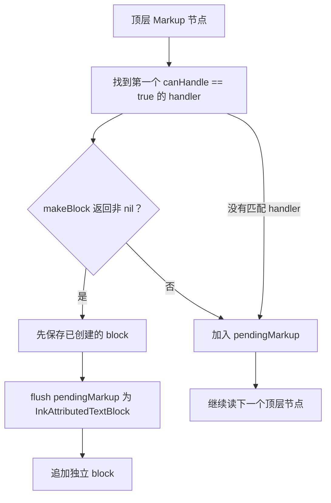
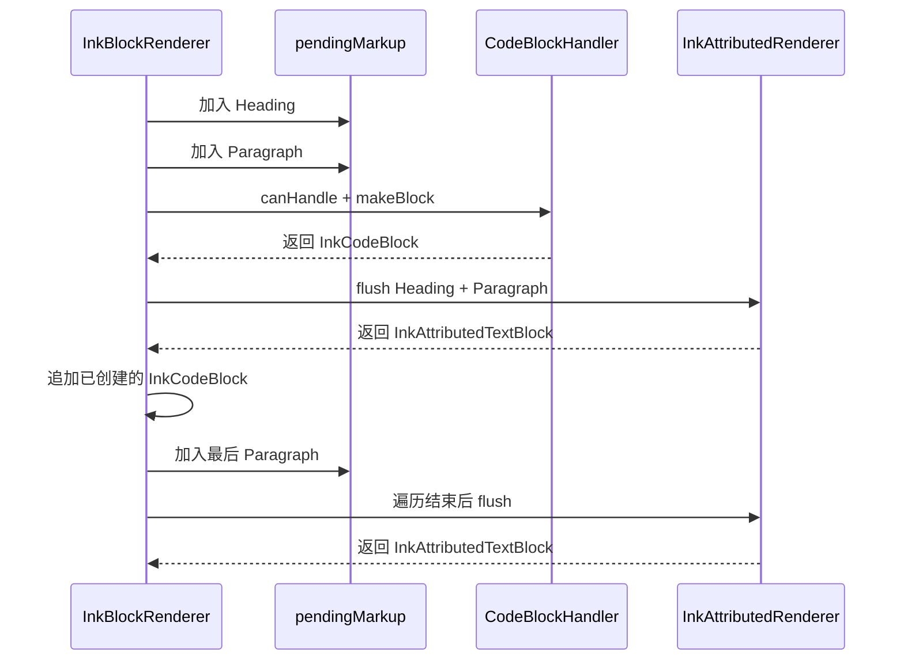
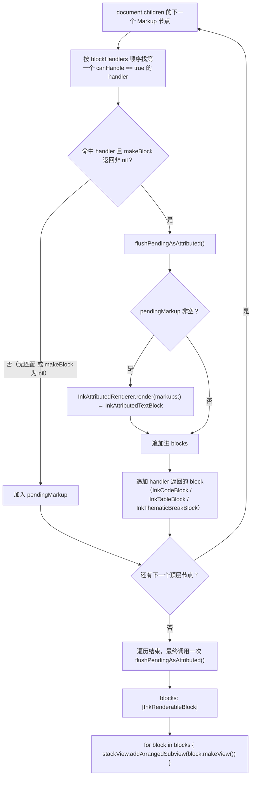

# 第 5 章：块路由与 UIKit 装配

**难度**：中级  
**预计时间**：50 分钟

本章只处理一个问题：如何把线性富文本和复杂 UIKit 块放进同一份 Markdown 结果。完成后，你能跟踪 `InkBlockRenderer` 的首匹配规则、`pendingMarkup` 冲刷时机和 `[InkRenderableBlock]` 的 UIKit 装配。

## 本章目标

学完后，你可以：

- 解释表格等内容为什么不适合只用 `NSAttributedString`。
- 按真实调用顺序说明 handler 匹配、block 创建和 pending flush。
- 预测一组顶层 `Markup` 节点会产生哪些 block。
- 在 `UIStackView` 或列表容器中装配 `[InkRenderableBlock]`。

## 前置知识

完成[第 4 章](04-inkmarkdown-render-pipeline.md)，能跟踪 `Markup` 到 `NSAttributedString` 的富文本通道。

## 5.1 为什么不能所有内容都塞进富文本

标题、段落、链接和列表主要是线性文字。表格和复杂代码块还需要列宽、边框、独立滚动、复制按钮和块级高度计算。

把这些布局与交互全部包成文字附件，会让宿主很难替换行为。InkMarkdown 因此使用两条渲染通道：



`makeBlock` 返回 `nil` 时，当前节点回落到 `pendingMarkup`。渲染器不会继续试后面的 handler。

## 5.2 InkRenderableBlock 是最小共同接口

富文本和独立块的内部数据不同，但它们最终都要进入 UIKit 视图树。

```swift
public protocol InkRenderableBlock {
  func makeView() -> UIView
}
```

当前常见实现如下：

| 内容 | Block 类型 |
| --- | --- |
| 相邻普通文字 | `InkAttributedTextBlock` |
| 围栏代码 | `InkCodeBlock` |
| GFM 表格 | `InkTableBlock` |
| 分割线 | `InkThematicBreakBlock` |

这个协议只统一装配边界，不强迫所有 block 使用同一份数据模型。

## 5.3 InkBlockHandler 的首匹配规则

Handler 先判断是否识别节点，再尝试创建 block。

```swift
public protocol InkBlockHandler {
  func canHandle(_ markup: Markup) -> Bool

  func makeBlock(
    from markup: Markup,
    configuration: InkConfiguration
  ) -> InkRenderableBlock?
}
```

当前默认顺序是代码块、表格、分割线。数组顺序就是优先级：

1. 渲染器只取第一个 `canHandle` 返回 `true` 的 handler。
2. 渲染器立即调用该 handler 的 `makeBlock`。
3. 若结果为 `nil`，节点进入富文本回退，不再试下一个 handler。

自定义 handler 若要覆盖默认行为，必须放在默认 handler 之前，并且在命中时返回可用 block。

## 5.4 pendingMarkup 为什么要批量冲刷

假设顶层节点顺序是：

```text
Heading → Paragraph → CodeBlock → Paragraph
```

真实调用顺序如下。Handler 先创建代码 block，渲染器再冲刷代码块之前累积的文字，最后按正确的输出顺序追加两者。



最终只创建三个 block，不会为每个普通节点单独创建 `UITextView`。这样既保留连续文字排版，也减少视图数量。

## 5.5 在 UIKit 中装配 block

前面两节分别讲了「怎么选 handler」和「怎么冲刷 pendingMarkup」，下面这张图把两者接到最后一步——`blocks` 数组怎么变成屏幕上的视图：



`InkBlockRenderer.render` 只负责产出 `blocks` 数组（图中到 L 为止）；从 `blocks` 到屏幕的最后一步（图中 M）由调用方决定容器，最小实现如下。

最小装配代码可以放在一个已有约束的竖向 `UIStackView` 中。

```swift
import UIKit
import InkMarkdown

let blocks = InkBlockRenderer.render(markdown)

let stackView = UIStackView()
stackView.axis = .vertical
stackView.spacing = 0

for block in blocks {
  stackView.addArrangedSubview(block.makeView())
}
```

这段只展示 block 装配，宿主仍要设置 stack view 约束和高度更新策略。可运行实现见 [`RenderedListViewController.swift`](../../ExampleApp/ExampleApp/Detail/Pager/RenderedListViewController.swift)。

### 选择静态渲染入口

先根据输出边界选入口，不要等表格显示失败后再换。

| 内容 | 入口 |
| --- | --- |
| 只需要线性富文本 | `InkAttributedRenderer.render` |
| 可能包含表格、独立代码块或分割线 | `InkBlockRenderer.render` |

`InkAttributedRenderer` 遇到表格时不会自动创建网格 `UIView`。调用方需要主动选择 block 边界。

## 5.6 跟练：看见真实路由

使用 ExampleApp 完成一次可观察的 block 路由。

1. 按[开发指南](../contributor-guide/04-development.md#运行-exampleapp)运行 ExampleApp。
2. 进入“自定义样式”→“表格”。
3. 在 `InkBlockRenderer.render` 中 handler 查找位置加断点。
4. 刷新该页，确认顶层 `Table` 由 `InkTableBlockHandler` 命中。
5. 查看返回的 blocks，确认表格是 `InkTableBlock`，相邻普通文本是 `InkAttributedTextBlock`。

成功标志是断点能观察到 `Table` 命中 handler，界面显示网格表格，而不是管道符原文。

## 5.7 练习：手动预测结果

先不运行代码，为下列顶层节点写出 block 顺序：

```text
Heading → Paragraph → Table → Paragraph → ThematicBreak
```

然后使用默认 configuration 在调试器中对照。

<details>
<summary>查看参考结果</summary>

```text
InkAttributedTextBlock → InkTableBlock → InkAttributedTextBlock → InkThematicBreakBlock
```

</details>

## 完成标准

继续下一章前，确认你已经完成以下任务：

- 在 ExampleApp 断点中观察到一次 `Table` handler 命中。
- 能解释为什么 handler 顺序是优先级。
- 能说明首个 handler 返回 `nil` 后的回退路径。
- 能预测练习中的 block 顺序。

## 下一步

- 继续[第 6 章：流式 Markdown 状态管线](06-streaming-rendering.md)。
- 需要查类型位置时，阅读[模块详解](../contributor-guide/05-modules.md)。
- 要修改表格或代码块行为，先核对[扩展语法规范](../spec/extended-syntax.md)。
