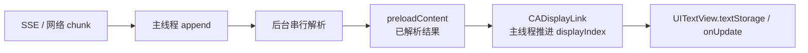
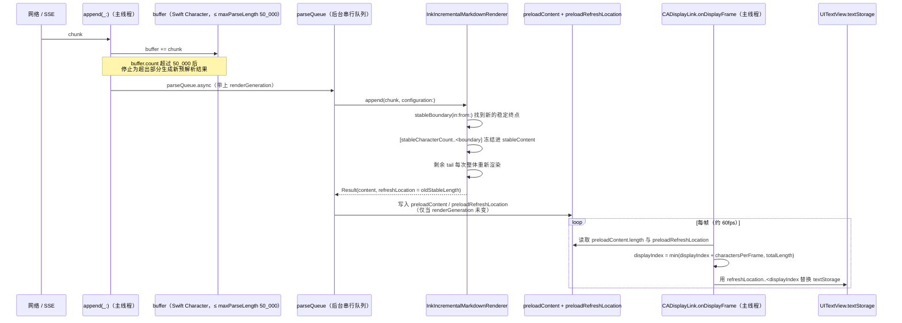
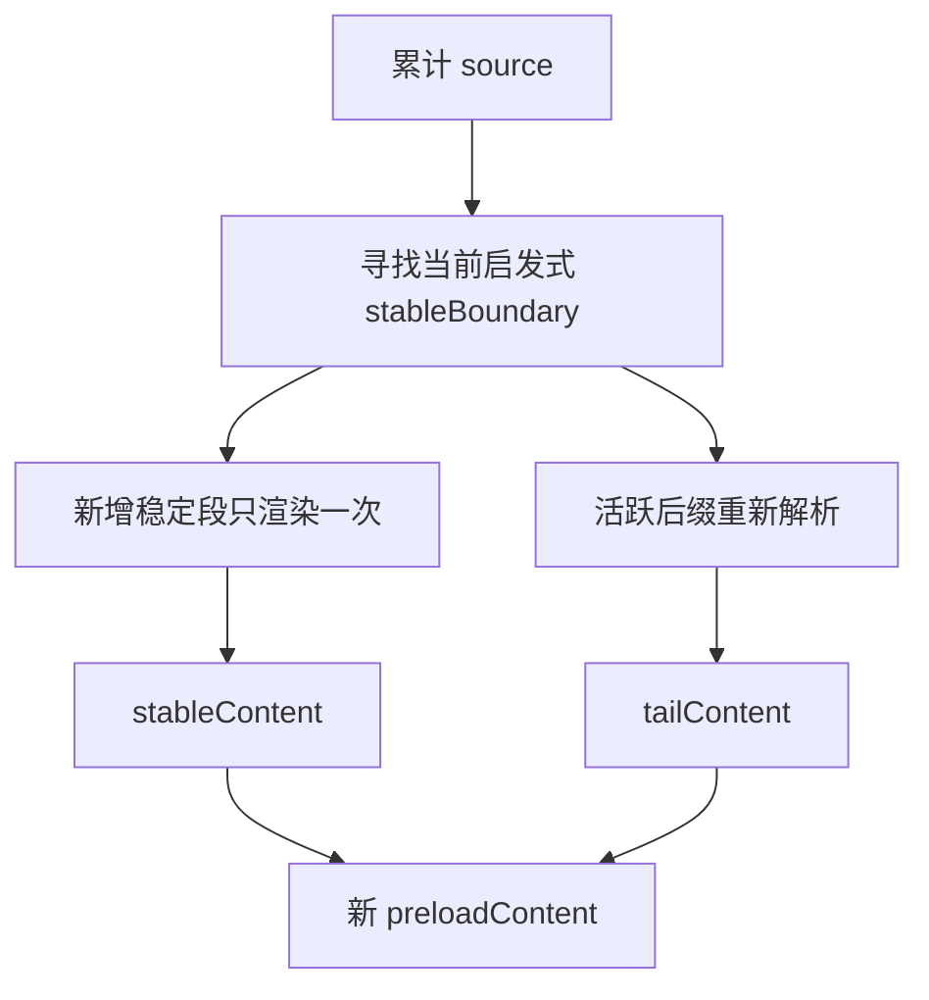
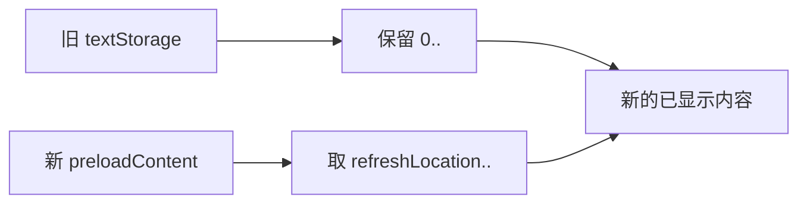

# 第 6 章：流式 Markdown 状态管线

**难度**：中级  
**预计时间**：75 分钟

本章跟踪一段不断增长的 Markdown，分清网络 chunk、后台解析、稳定前缀和逐帧显示。你还会验证当前实现的四个边界：主线程调用契约、`sourceFilter` 全量回退、50,000 个 Swift `Character` 上限和回调启动条件。

## 本章目标

学完后，你可以：

- 解释为什么网络 chunk 不是 Markdown 语法边界。
- 区分解析缓冲与可见显示进度。
- 说明稳定前缀、活跃后缀和 `refreshLocation` 的作用。
- 正确使用 `append`、`reset(to:)`、`finish()` 和显示回调。
- 在性能问题前检查 `sourceFilter` 和输入长度。

## 前置知识

完成[第 5 章](05-block-routing.md)，并知道 `NSAttributedString.length` 与人眼看到的字符数不一定相同。如果这个区别还不清楚，先回看[第 3 章的 NSRange](03-nsattributedstring-and-textkit.md#34-nsrange只把它当作位置--长度)。

## 先睹为快：用户逐帧看到什么

在进入内部实现和边界条款之前，先建立一个直觉：流式渲染在界面上到底长什么样。完整可运行示例见 6.10，这里先用同一段输入，看用户视角会经历什么。

假设依次追加三段内容，`charactersPerFrame = 2`（每帧推进 2 个富文本字符）：

```text
1. "## 标题\n"
2. "正在生成 **更多"
3. "内容**。"
```

下表是示意，用来建立直觉，不代表真实精确的帧号（真实帧数取决于后台解析速度和系统调度）：

| 阶段 | 用户在 `UITextView` 里看到的文字 | 背后发生了什么 |
| --- | --- | --- |
| ① | （空白） | 第 1 段刚 append，后台还在解析，尚未显示 |
| ② | `标` | `CADisplayLink` 开始按 `charactersPerFrame` 逐字吐出 |
| ③ | `标题`（换行） | 第一段标题吐完，`ATX` 标题行让稳定前缀往前推进一截 |
| ④ | `标题`\n`正在生成 更多` | 第 2 段到达；`**` 尚未闭合，所以“更多”两个字先以普通文本出现，看不到粗体 |
| ⑤ | `标题`\n`正在生成 **更多**内容。`（“更多”已变粗体） | 第 3 段补上闭合 `**` 后，已经显示过的“更多”被重新渲染成粗体 |

阶段 ④→⑤ 是本章后面所有条款要解释的核心现象：**已经显示在屏幕上的文字，样式还会被后续 chunk 改写**。6.2 会说明这是靠两套独立的进度（解析进度、显示进度）实现的，6.4/6.5 会说明“稳定前缀 vs 活跃后缀”和 `refreshLocation` 具体如何决定哪一段要被重写。完整可运行示例见 6.10。

## 6.1 网络 chunk 不是 Markdown 块

假设服务端分三次发送一段内容：

```text
第 1 次：阅读 **重
第 2 次：要内容** 和 [文
第 3 次：档](https://example.com)
```

第一次的 `**重` 尚未闭合。第二次让粗体完整，同时又开始一个未闭合链接。后续字符会改变当前尾部的节点、可见文字和 attributes。

因此，流式渲染器不能把每个 chunk 独立解析后永久拼接。它必须保留尚可变化的尾部。

## 6.2 解析和显示使用两个进度

`InkStreamRenderer` 在后台串行队列上生成 `preloadContent`，在主线程由 `CADisplayLink` 推进可见长度。



`currentAttributedString()` 读取已预解析的完整结果，它可能比当前界面已显示的部分更长。

### 完整双缓冲流程（把上面的方框展开）

上面的方框图只画了大方向，下面这张时序图把双缓冲设计的四个关键点串在一起：chunk 如何在 `buffer` 里累积、后台解析如何产出 `preloadContent`、稳定前缀/活跃后缀边界如何决定 `preloadRefreshLocation`，以及 `CADisplayLink` 如何按 `charactersPerFrame` 推进 `displayIndex`。图中方法名和字段名与 [InkStreamRenderer.swift](../../Sources/InkMarkdown/Rendering/InkStreamRenderer.swift) 一致：



这张图对应两条独立的时间线：**解析时间线**（`Net → App → Buf → BG → Inc → Pre`，由 chunk 到达和后台队列速度决定）和**显示时间线**（`DL` 那个 loop，由 `CADisplayLink` 帧率和 `charactersPerFrame` 决定）。`preloadContent` 是连接两条时间线的唯一缓冲区：解析线只管往里写最新结果，显示线只管按自己的节奏从里面读、往外吐字，两者互不阻塞。

## 6.3 先分清计数单位

实现同时使用 Swift 字符计数和 Foundation 富文本范围。它们不能直接比较。

| 值 | 当前单位 | 用途 |
| --- | --- | --- |
| `buffer.count` / 50,000 上限 | Swift `Character` | 限制原始输入长度 |
| `NSAttributedString.length` | UTF-16 code unit | 表示富文本长度 |
| `displayIndex` | UTF-16 位置 | 记录已显示到哪里 |
| `refreshLocation` | UTF-16 位置 | 记录需要替换的后缀起点 |
| `charactersPerFrame` | 当前按富文本长度推进 | 设置每帧前进量 |

`charactersPerFrame = 1` 不能精确承诺“每帧一个人眼字符”。复合 Emoji 和组合字符可能占多个 UTF-16 单位。当前 API 也没有验证该值，调用方应使用正整数。

## 6.4 稳定前缀与活跃后缀

当前算法将累计源文本概念上分为两段：

```text
[已缓存的稳定前缀] + [每次重新解析的活跃后缀]
```



当前实现只在已换行结束的以下位置推进边界：

- ATX 标题行。
- 分割线行。
- 与开始围栏字符相同、数量不少于开始围栏的闭合行。

普通空行不会自动冻结列表或引用。这是项目当前的保守启发式，不是通用增量 CommonMark 解析器。当前分类会先修剪行首尾空白，因此不应把它的缩进行判断当成完整 CommonMark 语义证明。

## 6.5 refreshLocation 只替换受影响后缀

后续字符补全链接或强调时，已显示尾部的文字长度和 attributes 都可能改变。`refreshLocation` 告诉显示层从哪个 UTF-16 位置开始替换。



此位置属于富文本范围，不是源 Markdown 的 Swift `String.Index`。

## 6.6 主线程契约是调用方责任

当前类注释要求在主线程调用所有会改变显示状态的公开 API，包括：

- `bindTextView(_:)`
- `unbindTextView()`
- `append(_:)`
- `reset(to:)`
- `finish()`

类本身当前没有 `@MainActor` 或运行时断言。后台队列和锁只保护内部的部分状态，不会为调用方自动纠正线程错误。

## 6.7 sourceFilter 会回退到每片全量渲染

稳定前缀优化只在 `configuration.sourceFilter == nil` 时使用。一旦配置 `sourceFilter`，每次 `append` 都会：

1. 对当前完整 `buffer` 调用 `InkAttributedRenderer.render`。
2. 将 `refreshLocation` 设为 `0`。
3. 让显示层从头考虑新结果。

原因是 filter 可以改写任意早期内容，渲染器无法证明旧前缀仍稳定。调查流式性能时，先检查此条件。

## 6.8 50,000 个 Swift Character 是当前硬上限

`InkStreamRenderer` 内部的 `maxParseLength` 当前固定为 `50_000`：

- `append` 让 buffer 超过上限后，停止为超出内容生成新预解析结果。
- `finish()` 只取前 50,000 个 Swift `Character` 做最终渲染。

超长输入会被静默截断，调用方需要在业务入口限制长度、分段，或在修改实现后同步更新[当前状态](../current-status.md)。

## 6.9 finish 做最终收口

`finish()` 表示输入不再增长。当前实现会：

1. 将输入截到上述上限。
2. 丢弃旧增量缓存。
3. 对截取后的最终文本做一次全量富文本渲染。
4. 让显示循环继续追上最终结果。
5. 解析完成且显示追上后调用 `onFinishDisplay`。

`onFinishDisplay` 触发后会被设为 `nil`。复用同一 renderer 开始新一轮时，需要重新赋值。

## 6.10 使用可见 UITextView 完成第一次流式更新

把下列代码放进一个已显示的 `UIViewController`，并确保 `textView` 已加入 view hierarchy。

```swift
import UIKit
import InkMarkdown

let renderer = InkStreamRenderer(configuration: .standard)
renderer.charactersPerFrame = 2
renderer.onUpdate = { visibleText in
  print("visible UTF-16 length:", visibleText.length)
}

renderer.bindTextView(textView)
renderer.append("## 标题\n")
renderer.append("正在生成 **更多")
renderer.append("内容**。")
renderer.finish()
```

预期现象：标题和粗体逐步出现，控制台长度递增，最后一次可见结果与 `currentAttributedString()` 的文字一致。

未绑定 `UITextView` 时，`onUpdate` 仍可接收显示进度，但前提是 DisplayLink 已启动。新建 renderer 后只调用 `append` 和 `finish` 不会启动它；当前启动点是 `bindTextView(_:)` 或非空 `reset(to:)`。

## 6.11 流式与 block 路由尚未自动串联

`InkStreamRenderer` 内部使用 `InkAttributedRenderer`，输出仍是富文本。它不会把每次流式结果自动转成 `[InkRenderableBlock]`。

`InkStreamTableView` 服务表格逐行场景，但任意流式 Markdown 表格不会因此自动从富文本通道切到 block 路由。设计业务集成时，先查对应组件 API 和当前状态。

## 6.12 练习：观察尾部变化

按顺序追加：

```text
1. "## 标题\n"
2. "正文 **尚未"
3. "结束**。\n"
```

在 `onUpdate` 中同时打印 `.string` 和 `.length`，再回答：

1. 第二次输入后，为什么不能永久缓存整个正文？
2. 第三次输入后，哪一段 attributes 可能改变？
3. 加入 `sourceFilter = { $0 }` 后，`refreshLocation` 为什么回到 `0`？

现有流式性能基准中的 `outputMatches` 只比较最终 `.string`，并未证明所有 attributes 都完全一致。练习时要分开观察文字和样式。

## 完成标准

继续下一章前，确认你已经完成以下任务：

- 运行一次绑定 `UITextView` 的三段 chunk 练习。
- 能分清 Swift `Character` 与 UTF-16 富文本位置。
- 能说明 `sourceFilter` 为什么会关闭稳定前缀优化。
- 知道 50,000 上限、未绑定回调启动条件和 `onFinishDisplay` 的一次性。
- 能解释 `finish()` 为什么还要全量收口。

## 下一步

- 继续[第 7 章：跟练调试、测试与第一次贡献](07-guided-debugging-and-exercises.md)。
- 想查流式类型和源码位置，阅读[模块详解](../contributor-guide/05-modules.md)。
- 开始性能改动前，先核对[核心原理](../contributor-guide/03-principles.md)与[当前状态](../current-status.md)。
