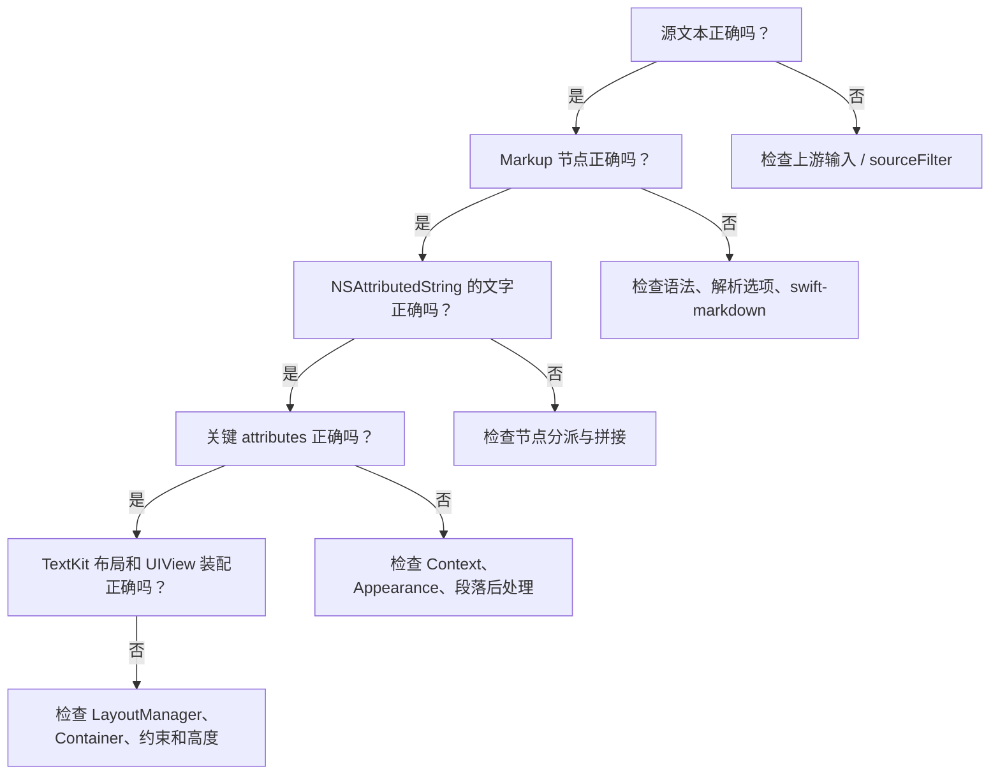

# 第 7 章：跟练调试、测试与第一次贡献

**难度**：初级到中级  
**预计时间**：90 分钟

## 本章目标

学完后，你可以：

- 使用 XcodeBuildMCP 发现并测试项目，而不是写死本机 Simulator UUID。
- 用断点确认源文本、Markup 节点和最终 attributes。
- 按“解析问题、渲染问题、布局问题”缩小故障范围。
- 阅读现有 Swift Testing 测试并新增一个小型语义测试。
- 按项目文档约束完成第一次安全修改。

## 前置知识

- 完成前六章。
- 已安装 Xcode 及项目要求的 Swift 工具链。
- 当前 Codex / MCP 客户端已加载 XcodeBuildMCP。若未加载，按根目录 `AGENTS.md` 的工具规则先检查安装和客户端注册。

## 7.1 先建立“证据链”调试习惯

当界面显示不符合预期时，不要直接在最终 `UIView` 上试样式补丁。沿数据流逐层确认：



这条链能避免“解析其实没问题，却去重写解析器”或“attribute 已经正确，却在 Renderer 里补布局 hack”。

## 7.2 使用 XcodeBuildMCP 建立可重复环境

本项目默认优先使用 [XcodeBuildMCP](https://www.xcodebuildmcp.com/) 完成项目发现、构建、测试、Simulator 和日志采集。

在支持该 MCP 的客户端中，推荐顺序是：

1. 查看当前 session defaults。
2. 如果项目、scheme 或 simulator 尚未设置，再发现项目和可用目标。
3. 选择 `InkMarkdown` scheme 与一个可用的 iOS Simulator；不要写死 UUID。
4. 执行 simulator test。
5. 记录实际 scheme、destination、测试数量和失败摘要。

不同客户端展示的工具按钮或参数可能不同，以当前 XcodeBuildMCP 暴露的 schema 为准。

XcodeBuildMCP 未加载、缺少 SwiftPM 测试能力或返回 scheme test action 错误时，按[开发指南的构建与测试流程](../contributor-guide/04-development.md#构建与测试)检查安装、客户端注册和原生命令回退。开发指南是这套流程的唯一维护入口。

### 为什么不能直接使用 swift test

InkMarkdown 直接依赖 UIKit。macOS host 上的 `swift test` 可能报 `no such module 'UIKit'`。这不是库逻辑测试失败。Swift Package 测试应选择 iOS Simulator destination。

## 7.3 第一次断点跟踪：普通加粗

测试输入：

```markdown
你好，**UIKit**。
```

建议按顺序设置断点：

1. `InkParser.parse(_:)`
2. `InkAttributedRenderer.render(_:configuration:)`
3. `InkRenderer.renderBlock(_:context:)`
4. `InkRenderer.renderInline(_:context:)`
5. 处理 `Markdown.Text` 的位置

其中 `InkRenderer` 是文件内私有类型，但仍可在 Xcode 源码行上设置断点。

每个断点只回答一个问题：

| 位置 | 要观察什么 |
| --- | --- |
| Parser | `source` 是否与预期一致 |
| render 入口 | `configuration` 是否使用正确 appearance |
| block dispatch | 当前节点是否为 `Paragraph` |
| inline dispatch | 是否依次看到 `Text`、`Strong` 及其子节点 |
| Text 叶子 | 最终 context 的字体是否包含 bold trait |

不要一开始就单步进入 swift-markdown 的 cmark 实现。先确认项目边界上的输入输出，只有解析树本身不正确时才深入依赖。

## 7.4 第二次断点跟踪：表格为什么走另一条路

测试输入：

```markdown
| 名称 | 状态 |
| --- | --- |
| Parser | 完成 |
```

设置断点：

1. `InkBlockRenderer.render(_:configuration:)`
2. `InkTableBlockHandler.canHandle(_:)`
3. `InkTableBlockHandler.makeBlock(from:configuration:)`
4. `InkTableBlock.makeView()`

观察：

- `Document.children` 中是否出现 `Markdown.Table`。
- 默认 handlers 中哪个最先返回 `true`。
- 命中前 pending 是否有普通节点。
- 最终 block 是否为 `InkTableBlock`。

如果直接调用 `InkAttributedRenderer.render`，这些 handler 断点不会命中。这正是入口选择造成的行为差异。

## 7.5 第三次断点跟踪：流式尾部为什么会刷新

按三次调用：

```swift
renderer.append("正文 **尚未")
renderer.append("结束**，再看 [文")
renderer.append("档](https://example.com)。")
renderer.finish()
```

关注以下位置：

- `InkStreamRenderer.append(_:)`
- `InkIncrementalMarkdownRenderer.append(_:configuration:)`
- `stableBoundary(in:from:)`
- `InkStreamRenderer.onDisplayFrame()`

记录每次的：

- `source`
- `stableCharacterCount`
- `tail`
- `refreshLocation`
- `displayIndex`
- `preloadContent.length`

目标不是记住数值，而是确认两条进度不同：解析可以领先，显示按帧追赶；活跃尾部的旧 attributes 也可能被替换。

## 7.6 用代码检查 attributes，而不是只看截图

```swift
let result = InkAttributedRenderer.render(
  "## [**重要**](https://example.com)"
)

let range = NSRange(location: 0, length: result.length)
result.enumerateAttributes(in: range) { attrs, range, _ in
  let content = result.attributedSubstring(from: range).string
  print("\(range): \(content)")
  print(attrs)
}
```

建议验证：

- 可见文字不包含 Markdown 标记符号。
- 链接文字有 `.link`。
- 字体保留标题字号和粗体 trait。
- 段落存在固定行高样式。

界面截图适合发现视觉问题，attribute 检查适合确认语义根因。两者互补。

`.link` 只证明富文本保存了 URL 数据。要验证“可点击”，还要使用可选择、不可编辑且配置了 delegate / `linkTapHandler` 的 text view。`InkAttributedTextBlock.makeView()` 已组装这条交互路径。

## 7.7 读懂项目现有 Swift Testing 测试

项目测试使用 Swift Testing，典型结构如下：

```swift
import Testing
@testable import InkMarkdown

@Test func example() {
  let result = InkAttributedRenderer.render("**重点**")
  #expect(result.string == "重点")
}
```

真实测试还会枚举 `.font`、`.foregroundColor`、`.paragraphStyle` 和自定义 attribute。先从这些已有测试学习项目断言风格：

- [`InkMarkdownTests.swift`](../../Tests/InkMarkdownTests/InkMarkdownTests.swift)
- [`RenderSnapshot.swift`](../../Tests/InkMarkdownTests/Snapshots/RenderSnapshot.swift)
- [`StreamingPerformanceTests.swift`](../../Tests/InkMarkdownTests/StreamingPerformanceTests.swift)

### 测试应该验证语义，不要锁死无关实现

推荐：

- 可见文字是否正确。
- 目标范围是否有关键 attribute。
- 链接 URL 是否正确。
- 固定行高是否符合 `InkAppearance`。
- 增量最终结果是否与全量结果一致。

谨慎：

- 直接比较整个 attribute 字典的字符串描述。
- 依赖系统字体内部名称。
- 依赖某台机器的 Simulator UUID。
- 只比较截图，不说明失败属于哪种语义。

## 7.8 第一次贡献练习：补一个现有行为的语义测试

先不要实现新语法。选择一个已交付但你能理解的行为，例如：

- 标题里的链接同时保留标题色之外的链接色和标题字号。
- 引用里的行内代码同时保留引用上下文和代码背景。
- 有序列表从指定起始编号显示。
- 流式未闭合强调在 `finish()` 后与全量结果一致。

执行流程：

1. 在[渲染语义规范](../spec/README.md)确认预期。
2. 在现有测试中找最接近的案例。
3. 只新增一个测试，先让它通过现有实现。
4. 用 XcodeBuildMCP 运行 iOS Simulator 测试。
5. 人为改错一个期望值，确认测试真的会失败，再恢复。
6. 记录 scheme、destination、测试数量和结果。

完成标准：失败信息能明确告诉维护者“哪条语义被破坏”，而不是只说快照不同。

## 7.9 第二次贡献练习：修改一个主题值

目标：只调整单次渲染中的正文颜色，不改变全局默认。

```swift
var appearance = InkAppearance()
appearance.text.color = .systemPurple

let configuration = InkConfiguration(appearance: appearance)
let result = InkAttributedRenderer.render(
  "正文与 [链接](https://example.com)",
  configuration: configuration
)
```

验证：

- 正文使用紫色。
- 链接仍使用 `appearance.link.color`。
- 其他使用 `.standard` 的渲染不受影响。

这个练习帮助你理解 Context 中“继承基础样式”和“子语义覆盖某个属性”的区别。

## 7.10 第三次贡献练习：为新需求选择正确扩展点

先只做设计判断，不写代码。

| 需求 | 应选边界 |
| --- | --- |
| 把 `$用户$` 显示为业务链接 | `InkInlineSyntax` |
| 把自定义顶层节点显示为卡片 | `InkBlockHandler` |
| 删除传输层的 `<ref />` | `sourceFilter` |
| 修改所有正文段后距 | `InkAppearance.Text` |
| 改圆角代码背景绘制 | `InkMarkdownLayoutManager` + 对应 attribute 信息 |
| 增加 CommonMark 本身没有的嵌套语法 | 先评估解析层，不应只在最终 UIView 打补丁 |

对每个选择写一句理由，格式是：

> 这个边界拥有所需输入，并且不会承担其他层的职责。

## 7.11 症状式排查表

| 症状 | 先检查 | 常见原因 |
| --- | --- | --- |
| Markdown 标记原样显示 | Markup 树 | 写法未闭合、节点未专门处理、走了降级路径 |
| 表格未形成网格、为空或退化 | 先看 `Document.children` 是否有 `Table` | 源文本没有解析成 GFM 表格，或解析正确但选了富文本入口 |
| 链接文字有颜色但点不了 | `.link`、text view delegate、selection | 只有颜色 attribute，或交互视图配置不完整 |
| 标题里的链接颜色被标题色覆盖 | run attributes、Context 派生顺序 | 父级后处理覆盖子样式 |
| 行内代码有字体但无圆角背景 | 自定义 attribute、LayoutManager | 使用了普通 UITextView 默认布局管理器 |
| 流式内容闪回旧结果 | generation、后台回写时机 | reset/finish 后旧任务未被丢弃 |
| `swift test` 报 UIKit 不存在 | 测试 destination | 错在 macOS host 运行 UIKit 包 |
| 测试只在某台机器能运行 | destination 配置 | 写死 Simulator UUID 或型号 |

## 7.12 开发前后的最小检查清单

开发前：

- 阅读 `docs/current-status.md`，确认能力是否已实现。
- 在 `docs/spec/` 确认预期语义。
- 找到最接近的现有测试。
- 判断问题属于解析、富文本、块路由、TextKit 还是流式层。

开发后：

- 新行为有语义测试。
- 使用 iOS Simulator 运行相关测试。
- 没有把 `Packages/Caches/`、`.build/`、DerivedData 提交到仓库。
- 状态、规范或公开 API 变化时同步更新对应文档。
- README 核心信息变化时同时更新中英文版本。

## 完成标准

你已经准备好继续开发，当你能独立完成以下闭环：

1. 用最小输入稳定复现问题。
2. 打印或观察真实 Markup 树。
3. 检查最终文字与关键 attributes。
4. 找到正确的共享边界，而不是在最终 UI 加症状补丁。
5. 新增一个会在回归时失败的测试。
6. 用 XcodeBuildMCP 在 iOS Simulator 验证。
7. 同步必要的状态、规范或开发文档。

## 下一步

- 继续[第 8 章：用主流库读懂 InkMarkdown 的定位](08-library-landscape-and-design-tradeoffs.md)，将项目边界放回 iOS Markdown 生态中理解。
- 开始实际改动时，按任务查阅[贡献者指南](../contributor-guide/README.md)、[渲染语义规范](../spec/README.md)和[模块地图](../contributor-guide/05-modules.md)。
- 遇到术语时使用[术语表](glossary.md)。
