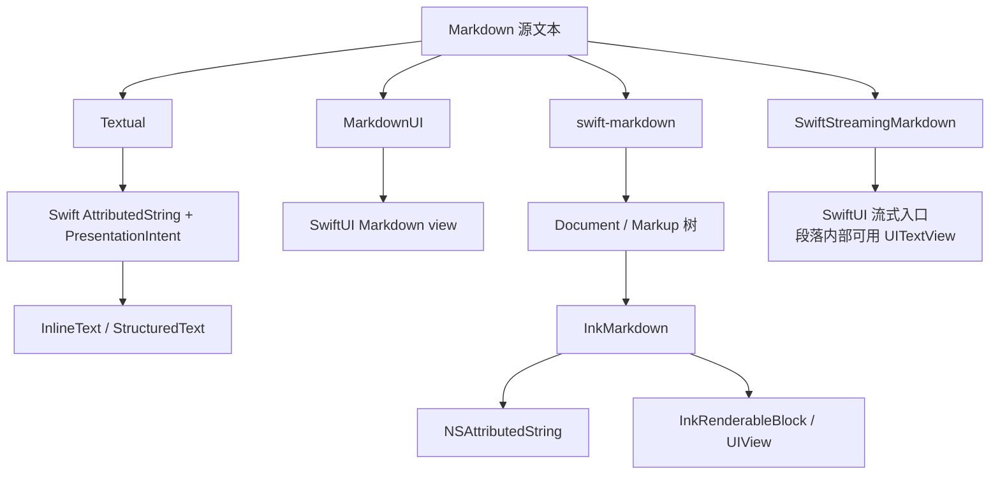

# 第 8 章：用主流库读懂 InkMarkdown 的定位

**难度**：初中级  
**预计时间**：60 分钟

本章带你用同一套问题阅读五个 Markdown 库。完成后，你能区分解析器、渲染器、公开 UI 边界和流式管线，不再只用“支持 Markdown”判断两个库是否重复。

## 本章目标

学完后，你可以：

- 为一个 Markdown 库画出“输入 → 中间模型 → 公开输出”。
- 解释 swift-markdown 为什么是解析层，而不是 UIKit 渲染器。
- 区分 MarkdownUI、Textual 与 InkMarkdown 的公开 UI 边界。
- 说明“内部使用 `UITextView`”和“向 UIKit 宿主公开 API”的区别。
- 根据项目场景选择需要的类型，而不是背库名。

## 前置知识

先完成[第 7 章](07-guided-debugging-and-exercises.md)，或至少能解释 `Markup`、`NSAttributedString`、SwiftUI `View` 和 `UIView` 的区别。对比中的外部事实统一来自 [iOS Markdown 库定位对比](../references/ios-markdown-ecosystem.md)。

## 8.1 不要从功能列表开始

“支持标题、链接和表格”无法说明一个库适合放在哪层。先为它填一张架构卡：

```text
输入：Markdown 字符串还是已解析数据？
解析：谁识别 CommonMark / GFM？
中间模型：Markup 树、AttributedString，还是其他模型？
公开输出：SwiftUI View、NSAttributedString，还是 UIView？
更新方式：整体重算还是面向流式？
```

这五项能直接显示库之间是上下游关系、交叉关系，还是真正重复。

## 8.2 先画公开数据流

下图只保留宿主最需要知道的输入和输出。



这张图显示 swift-markdown 可以是 InkMarkdown 的上游，而 MarkdownUI 和 Textual 主要服务 SwiftUI 显示。它们都处理 Markdown，但不在同一个公开边界上交付结果。

## 8.3 逐张填架构卡

使用参考页填写下表，不需记忆所有类型名。

| 库 | 你应先记住什么 | 不要误解为什么 |
| --- | --- | --- |
| swift-markdown | 产出可遍历、改写的 `Markup` 树 | 它不决定 UIKit 外观 |
| MarkdownUI | 向 SwiftUI 交付只读 Markdown view 和分层主题 API | 它不返回 InkMarkdown 需要的 UIKit block 数组 |
| Textual | 是 SwiftUI 文本引擎，Markdown 是其中一种 parser | 它不是 swift-markdown `Markup` 渲染后端 |
| SwiftStreamingMarkdown | 面向 LLM 的 SwiftUI 流式产品管线 | 内部用 `UITextView` 不等于公开 UIKit 库边界 |
| InkMarkdown | 用 `Markup` 生成 UIKit 富文本和独立块 | 它不提供 SwiftUI 渲染器 |

## 8.4 区分三组容易混淆的话

这三组概念决定了你能否看懂项目定位。

### 解析器与渲染器

解析器回答“这些字符是什么结构”。渲染器回答“这个结构怎样显示”。swift-markdown 与 InkMarkdown 分别负责这两层。

### 内部实现与公开边界

一个 SwiftUI 库可以在内部包装 `UITextView`，但 UIKit 宿主仍然不一定能直接拿到 `NSAttributedString`、替换 block handler 或组装自定义 `UIView`。讨论“是否支持 UIKit”时，必须说清是内部实现还是公开 API。

### 网络分片与增量语义

能够接收逐步变长的文本，不代表库会缓存稳定前缀或精确替换受影响后缀。比较流式库时，还要查输入是 chunk 还是完整快照，以及最终结果如何收口。

## 8.5 把对比用回 InkMarkdown

外部库最有价值的作用是帮你看见可选的边界，而不是复制 API。

| 看到的设计 | 对 InkMarkdown 的意义 |
| --- | --- |
| swift-markdown 的结构化树与 Walker / Rewriter | 保持解析层独立，不用渲染器重写 CommonMark |
| MarkdownUI 分开行内和块样式 | 审视 `InkAppearance` 时区分字符属性与块布局 |
| Textual 的可组合 `TextProperty` 与统一 Style | 为未来 Theme 组合提供参考，但保留 UIKit 可用类型 |
| SwiftStreamingMarkdown 的专用流式入口 | 将流式视为独立状态管线，不只是多次调用静态 renderer |

这些只是设计参考。项目当前已交付什么，仍以[当前状态](../current-status.md)和测试为准。

## 8.6 动手练习

这组练习要求你说出选择理由，而不是只写库名。

### 练习 A：填架构卡

从 [iOS Markdown 库定位对比](../references/ios-markdown-ecosystem.md) 选两个库，分别写出输入、中间模型、公开输出和更新方式。

<details>
<summary>参考答案：以 MarkdownUI 为例</summary>

架构卡不要求你选的两个库和下面一致，这里只演示怎么填，帮助你核对自己的格式和颗粒度是否合适。

```text
库：MarkdownUI
输入：Markdown 字符串
解析：库自身完成 GFM 解析
中间模型：MarkdownContent 与块序列
公开输出：只读 SwiftUI `Markdown` view
更新方式：常规整体渲染，不是专用流式管线
```

对照对比表可以看到，这五项分别对应“主要职责”“中间模型”“公开显示边界”“流式定位”几列。如果你选的是 InkMarkdown，公开输出这一项应该同时写 `NSAttributedString` 和 `InkRenderableBlock` / `UIView`，因为它有两条公开通道，不是只有一种。

</details>

### 练习 B：为场景选边界

为下列场景选择“需要的类型”，再查找符合边界的库：

1. iOS 14 UIKit 项目需要把结果放入现有 `UITableViewCell`，并自定义表格 `UIView`。
2. SwiftUI 项目需要只读 GFM 文档和主题定制。
3. 工具只需统计 Markdown 中的链接，不显示 UI。
4. SwiftUI 聊天页需要针对 LLM 的流式显示与数学公式。

参考思路依次是：UIKit 富文本与 block 边界、SwiftUI Markdown view、Markup 遍历、SwiftUI 流式管线。

<details>
<summary>参考答案：场景对应的库</summary>

| 场景 | 需要的类型 | 对应的库 | 理由 |
| --- | --- | --- | --- |
| 1. UIKit + `UITableViewCell` + 自定义表格 `UIView` | UIKit 富文本与 block 边界 | InkMarkdown | 它是当前对比里唯一向 UIKit 宿主直接公开 `NSAttributedString` / `InkRenderableBlock` / `UIView` 的库，表格可以走 block handler 路由成自定义 `UIView` |
| 2. SwiftUI 只读文档 + 主题定制 | SwiftUI Markdown view | MarkdownUI | 公开的是只读 SwiftUI `Markdown` view，并通过 `Theme` 等 API 支持分层定制 |
| 3. 只统计链接，不显示 UI | Markup 遍历 | swift-markdown | 不需要任何渲染器，直接用 `MarkupWalker` 遍历 `Markup` 树统计链接即可 |
| 4. SwiftUI 聊天页 + LLM 流式 + 数学公式 | SwiftUI 流式管线 | SwiftStreamingMarkdown | 专门面向 LLM 响应的流式渲染，公开 `StreamedMarkdownSource` / `StreamedMarkdownView`，并支持数学公式 |

注意第 1 项不要因为“也支持 Markdown”就选 MarkdownUI 或 Textual——它们的公开边界都是 SwiftUI view，UIKit 宿主拿不到可以自定义的 `UIView`。

</details>

### 练习 C：追溯一条结论

在对比页中选择一条外部结论，点开对应仓库来源，找到支持结论的 README、DocC 或源码。这一步能防止把二手摘要当成永不变的 API 契约。

<details>
<summary>参考答案：追溯流程示例</summary>

这里不给某一条结论的“标准答案”，因为你可以任选一条；下面演示追溯的步骤，供你核对自己的方法是否到位。

以对比页“MarkdownUI：SwiftUI Markdown 渲染器”一节里的结论——“主要扩展边界是 `Theme`、`markdownTextStyle`、`markdownBlockStyle` 和 `CodeSyntaxHighlighter`”——为例：

1. 在对比页底部“来源与局限”里找到对应链接：[MarkdownUI README](https://github.com/gonzalezreal/swift-markdown-ui/blob/main/README.md) 和 [`Markdown` view 源码](https://github.com/gonzalezreal/swift-markdown-ui/blob/main/Sources/MarkdownUI/Views/Markdown.swift)。
2. 打开链接，确认 README 或源码里确实出现 `Theme`、`markdownTextStyle`、`markdownBlockStyle`、`CodeSyntaxHighlighter` 这几个名字，而不是仅凭对比页的转述。
3. 记录你查看时的版本或日期（对比页本身标注了“核对日期：2026-07-14”），因为三方库的公开 API 会随版本变化。
4. 如果发现结论和最新仓库不一致，先不要直接改学习路径文档——按对比页末尾“维护规则”，先更新对比页，再回来复查第 8 章。

追溯别的结论时，方法是一样的：找引用来源 → 打开原始 README / DocC / 源码 → 核对具体 API 名称是否存在 → 记录核对时间。

</details>

## 完成标准

你能用自己的话回答以下问题即可：

- swift-markdown 与 InkMarkdown 是重复库，还是上下游？
- MarkdownUI 的主题 API 为什么值得参考，却不能直接替代 UIKit 输出？
- 一个库内部使用 `UITextView`，为什么不足以证明它提供 UIKit 公开边界？
- 比较两个流式库时，除了帧率还要问哪些语义问题？

## 下一步

- 读[项目概述](../contributor-guide/01-overview.md)，用本章的五个问题复核 InkMarkdown 的定位。
- 读[路线图](../roadmap.md)，区分已交付能力与受外部库启发的未来设计。
- 开始修改代码前，按[开发指南](../contributor-guide/04-development.md)建立可重复的构建和测试环境。
