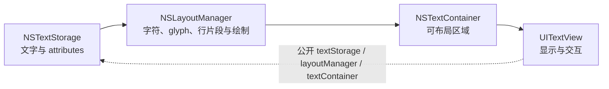

# Apple 文本系统 API 速查

本页是 Reference，用于查找 InkMarkdown 涉及的 Foundation 与 UIKit 文本 API。学习概念时先读[第 3 章](../learning-path/03-nsattributedstring-and-textkit.md)。

> 核对日期：2026-07-14。类型概要与可用版本由 Apple Developer Documentation 核对；InkMarkdown 的采用方式以当前源码为准。

## 按任务查 API

先根据任务选择类型，再进入 Apple 的完整 API 页。

| 任务 | 主要类型 | Apple 的定位 | 最低 iOS |
| --- | --- | --- | --- |
| 保存按范围分配的文字与属性 | `NSAttributedString` | 管理字符范围上的数据、排版信息和样式信息 | 3.2 |
| 追加文字或修改属性 | `NSMutableAttributedString` | 可修改的富文本字符串 | 3.2 |
| 使用 Swift 值语义富文本 | `AttributedString` | 带属性的 Swift 值类型，支持从 Markdown 创建 | 15.0 |
| 表示一段位置和长度 | `NSRange` | 描述序列中的一部分 | 2.0 |
| 显示可滚动、可选择的多行文本 | `UITextView` | 可滚动的多行文本区域 | 2.0 |
| 在 TextKit 1 中保存并通知富文本变更 | `NSTextStorage` | TextKit 的基础存储机制 | 7.0 |
| 在 TextKit 1 中布局和绘制字形 | `NSLayoutManager` | 协调文字字符的布局与显示 | 7.0 |
| 限定文字可使用的布局区域 | `NSTextContainer` | 文字发生布局的区域 | 7.0 |

## 区分两种 AttributedString

`NSAttributedString` 和 Swift `AttributedString` 都能表示富文本，但它们的可用版本和使用方式不同。

| 对比 | `NSAttributedString` | `AttributedString` |
| --- | --- | --- |
| 类型模型 | Foundation 引用类型 | Swift 值类型 |
| 可用版本 | iOS 3.2+ | iOS 15+ |
| 常用范围 | `NSRange` | `AttributedString.Index` / Swift 范围 |
| UIKit 接入 | `UITextView.attributedText` 直接接收 | 需根据宿主 API 转换或使用对应的 SwiftUI 路径 |
| InkMarkdown | 当前公开输出 | 不是当前公开输出 |

InkMarkdown 支持 iOS 14，公开渲染边界又是 UIKit，因此选择 `NSAttributedString` 是项目约束，不是对 Swift `AttributedString` 的通用优劣判断。

## TextKit 1 对象关系

TextKit 1 把存储、布局区域和字形绘制分给不同对象。

`UITextView` 同时提供 `layoutManager` 和 `textLayoutManager` 等访问点。这表明系统有 TextKit 1 与 TextKit 2 路径，不代表应用已自动采用项目需要的自定义布局管理器。

InkMarkdown 在 `InkAttributedTextBlock.makeView()` 中显式组装 `InkMarkdownLayoutManager`。宿主若只把渲染结果赋给任意 `UITextView.attributedText`，标准属性仍可显示，但项目自定义的行内代码圆角背景和引用竖线不保证出现。

## 常用查找路径

使用下表快速缩小问题范围。

| 现象 | 先查 | 再查 InkMarkdown |
| --- | --- | --- |
| 文字内容正确，字体或颜色错误 | `NSAttributedString` attributes | `InkTextContext` 与行内叶子渲染 |
| 行高、缩进或段后距错误 | `NSParagraphStyle` | `applyFixedLineHeight` |
| 自定义背景形状错误 | `NSLayoutManager` 绘制回调 | `InkMarkdownLayoutManager` |
| 换行区域或边距错误 | `NSTextContainer` | block view 的 container 配置 |
| 链接无法点击 | `UITextView` 选择、delegate 与 `.link` | `InkAttributedBlockTextView` 与 `linkTapHandler` |

## Apple 官方来源

- [`NSAttributedString`](https://developer.apple.com/documentation/foundation/nsattributedstring)
- [`NSMutableAttributedString`](https://developer.apple.com/documentation/foundation/nsmutableattributedstring)
- [`AttributedString`](https://developer.apple.com/documentation/foundation/attributedstring)
- [`NSRange`](https://developer.apple.com/documentation/foundation/nsrange)
- [`UITextView`](https://developer.apple.com/documentation/uikit/uitextview)
- [`NSTextStorage`](https://developer.apple.com/documentation/uikit/nstextstorage)
- [`NSLayoutManager`](https://developer.apple.com/documentation/uikit/nslayoutmanager)
- [`NSTextContainer`](https://developer.apple.com/documentation/uikit/nstextcontainer)
- [TextKit](https://developer.apple.com/documentation/uikit/textkit)

## 维护规则

当项目的最低 iOS 版本、公开富文本类型或 TextKit 路径变化时，同步核对本页、[第 3 章](../learning-path/03-nsattributedstring-and-textkit.md)和[架构文档](../contributor-guide/02-architecture.md)。
