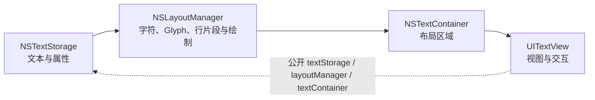

# Apple 文本系统 API 速查

用于查找 InkMarkdown 使用的 Foundation 与 UIKit 文本 API。以本文档与源码实现为准。

> 核对日期：2026-07-14。基于 Apple Developer Documentation 与 InkMarkdown 当前源码。

## 常用 API 清单

| 任务 | 主要类型 | 职责描述 | 最低 iOS |
| --- | --- | --- | --- |
| 保存带样式的文本 | `NSAttributedString` | 管理字符范围、排版与样式属性 | 3.2 |
| 追加文本或修改属性 | `NSMutableAttributedString` | 可变的富文本字符串 | 3.2 |
| 使用 Swift 值语义富文本 | `AttributedString` | 带属性的 Swift 值类型，支持从 Markdown 构建 | 15.0 |
| 表示范围与长度 | `NSRange` | 描述字符范围 | 2.0 |
| 多行可滚动文本显示 | `UITextView` | 可滚动的多行文本视图 | 2.0 |
| TextKit 1 富文本存储与变更通知 | `NSTextStorage` | TextKit 基础存储组件 | 7.0 |
| TextKit 1 字符排版与字形绘制 | `NSLayoutManager` | 协调字符布局与显示绘制 | 7.0 |
| 限定文本布局区域 | `NSTextContainer` | 定义文本排版的几何区域 | 7.0 |

## NSAttributedString 与 Swift AttributedString

| 维度 | `NSAttributedString` | `AttributedString` |
| --- | --- | --- |
| 类型模型 | Foundation 引用类型 | Swift 值类型 |
| 最低版本 | iOS 3.2+ | iOS 15+ |
| 范围表示 | `NSRange` | `AttributedString.Index` / Swift Range |
| UIKit 结合 | `UITextView.attributedText` 直接支持 | 需要转换为 `NSAttributedString` 或用于 SwiftUI |
| InkMarkdown | 当前公开导出类型 | 未作为公开导出类型 |

由于 InkMarkdown v0.0.2 的部署目标为 iOS 15+，且使用 UIKit rendering engine，因此选用 `NSAttributedString` 作为核心输出形态；iOS / iPadOS 15 runtime 仍待验证，不能仅凭部署声明视为已交付支持。

## TextKit 1 架构与对象关系

TextKit 1 将数据存储、几何区域与字形绘制解耦管理：

`UITextView` 同时公开 `layoutManager` 与 `textLayoutManager`。虽然系统包含 TextKit 1 与 TextKit 2 路径，但默认自动构建的 `UITextView` 不会自动挂载项目的自定义布局管理器。

InkMarkdown 在 `InkAttributedTextBlock.makeView()` 中显式组装 `InkMarkdownLayoutManager`。若直接将渲染结果赋给标准 `UITextView.attributedText`，基本文本样式正常显示，但行内代码圆角背景与引用块竖线依赖自定义 LayoutManager 的绘制逻辑。

## 常见排查路径

| 现象 | 排查重点 | InkMarkdown 代码位置 |
| --- | --- | --- |
| 字体或颜色异常 | `NSAttributedString` 属性 | `InkTextContext` 与行内叶节点渲染 |
| 行高、缩进或段间距异常 | `NSParagraphStyle` | `applyFixedLineHeight` |
| 背景圆角或图形绘制异常 | `NSLayoutManager` 绘制回调 | `InkMarkdownLayoutManager` |
| 换行或边距异常 | `NSTextContainer` | 块视图 container 配置 |
| 链接点击无响应 | `UITextView` 手势、Delegate 与 `.link` 属性 | `InkAttributedBlockTextView` 与 `linkTapHandler` |

## Apple 官方 API 链接

- [`NSAttributedString`](https://developer.apple.com/documentation/foundation/nsattributedstring)
- [`NSMutableAttributedString`](https://developer.apple.com/documentation/foundation/nsmutableattributedstring)
- [`AttributedString`](https://developer.apple.com/documentation/foundation/attributedstring)
- [`NSRange`](https://developer.apple.com/documentation/foundation/nsrange)
- [`UITextView`](https://developer.apple.com/documentation/uikit/uitextview)
- [`NSTextStorage`](https://developer.apple.com/documentation/uikit/nstextstorage)
- [`NSLayoutManager`](https://developer.apple.com/documentation/uikit/nslayoutmanager)
- [`NSTextContainer`](https://developer.apple.com/documentation/uikit/nstextcontainer)
- [TextKit](https://developer.apple.com/documentation/uikit/textkit)

## 维护规则

最低支持 iOS 版本、公开富文本接口或 TextKit 机制变更时，同步更新本文档与[架构文档](../contributor-guide/02-architecture.md)。
